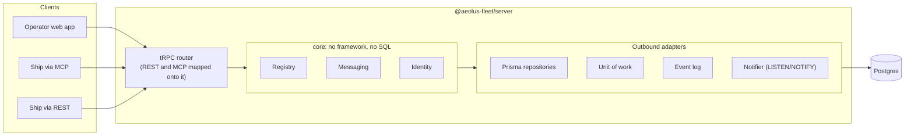
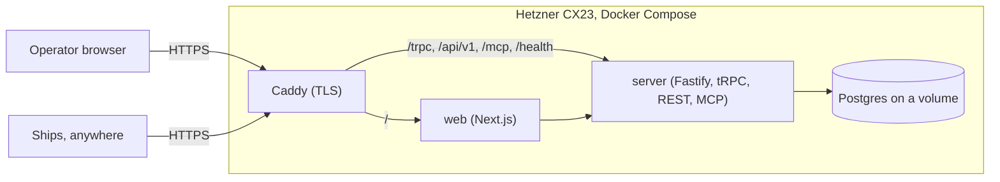

# Aeolus: solution and technical architecture (v0)

Owner: Thomas Hendrickx. Last updated 2026-09-29.

## Summary

Aeolus is three npm packages and one Postgres database. `@aeolus-fleet/server` exposes one API, a tRPC router, that every client uses: the operator web app, and ships through MCP or through REST generated from the same router. `@aeolus-fleet/web` is a Next.js operator console that calls only that API. `@aeolus-fleet/common` holds what both share: schemas, ids and types.

Inside the server, the three domain contexts from the blueprint (Registry, Messaging, Identity) are built as ports and adapters, so the domain never imports a framework or the database. Every record belongs to a fleet (the tenant), so one installation can later host several fleets at no extra cost.

The delivery guarantee lives in Postgres, not in application memory: a message is stored with its deliveries in one transaction before the sender gets an OK, and a delivery is claimed with row locks so two sessions can never take the same one. Postgres `LISTEN/NOTIFY` wakes waiting receivers and feeds live updates over WebSockets.

How it runs is not part of the product. Your own setup (Hetzner, Docker Compose, Caddy) lives in a separate private infra repository; anyone else can run the packages wherever they like, within the hosting constraints described under Deployment.

Companion document: [the product and domain blueprint](blueprint.md).

## Solution architecture

The server has exactly one API door: a tRPC router. The web app calls it like any other client, so there is no private back door for the console. For ships, the same procedures are also reachable as REST (with an OpenAPI spec generated from the router) and as MCP tools, so an agent gets identical behaviour whichever way it connects. Behind the door, the domain core is built as ports and adapters.



### The router

| Procedure group | Authenticated by | Reachable as | Examples |
| --- | --- | --- | --- |
| Ship procedures | Ship secret (bearer) | tRPC, REST, MCP | Register, receive, send, acknowledge, deregister |
| Operator procedures | Operator session (cookie) | tRPC | Commission, rename, release, retire, get starting prompt, resend, dismiss, inbox |
| Operator-only web procedures | Operator session | tRPC | Sign in, sign out, first-run setup, change password |
| Live subscriptions | Operator session | tRPC over WebSocket | Fleet snapshot changes, inbox changes, delivery state changes |

The only procedures that exist purely for the web app are the last two groups: sign-in and live updates. Everything else the operator does is an ordinary procedure that a script or a future CLI could call the same way.

### Use cases (inbound ports)

| Context | Use cases |
| --- | --- |
| Registry | Commission ship, rename ship, register session (claim lease), release ship, retire ship, issue starting prompt, list fleet |
| Messaging | Send message, receive deliveries, acknowledge delivery, resend or dismiss undeliverable, mark operator message read or done |
| Identity | Create operator account (first run), sign in, sign out, change password, reset password (server command), verify ship secret |

### Outbound ports

| Port | Purpose | v1 adapter |
| --- | --- | --- |
| Repositories per aggregate (Ship, Message, Delivery, Credential, OperatorAccount) | Load and store aggregates, always scoped to one fleet | Prisma on Postgres |
| `UnitOfWork` | Run a use case in one database transaction | Prisma interactive transaction |
| `EventLog` | Append domain events: timeline, audit, live updates | Postgres table, written in the same transaction |
| `Notifier` | Wake receivers and live subscriptions after commit | Postgres `LISTEN/NOTIFY` |
| `SecretHasher`, `PasswordHasher` | Hash ship secrets (SHA-256) and the operator password (Argon2id) | Node crypto, an Argon2 library |
| `Clock`, `IdGenerator` | Time and prefixed ids, injectable so tests are deterministic | System clock, id library |

The one cross-context call, Messaging asking Registry to resolve a selector and check that a ship is not retired, goes through a Registry port, never through Registry's tables.

## Deployment

The product is the npm packages; how they run is up to whoever installs them. Your own setup lives in a separate private infra repository: one Hetzner CX23 running Docker Compose with Caddy, the `server` and `web` processes, and Postgres on a volume. Every client, operator or ship, connects outward over HTTPS, so a ship can run anywhere that reaches the server.



| Path | Served by | Used by | What |
| --- | --- | --- | --- |
| `/` | web | Operator | The Next.js console |
| `/trpc` | server | Web app, TypeScript clients | The tRPC router, including WebSocket subscriptions |
| `/api/v1` | server | Ships | REST generated from the ship procedures, with an OpenAPI spec |
| `/mcp` | server | Ships | The ship procedures as a remote MCP server (streamable HTTP) |
| `/health` | server | Monitoring | Liveness and database check |

Only ports 80 (redirect) and 443 are open, and the fleet is reachable over public HTTPS: ship secrets carry the security. Postgres listens on the Compose network only. Estimated cost stays as in the blueprint: about €12.50 a month including VAT.

### Running elsewhere

Anyone can run the packages on other hosting, within two constraints that come from the design:

| Package | Hosting requirement | Works on |
| --- | --- | --- |
| `web` | Any Next.js host | Vercel, any Node host, a container |
| `server` | A long-running Node process: it holds WebSockets, long-poll receives and a `LISTEN` connection. Serverless functions cannot do this | Any VM or container host (Fly.io, Railway, Render, a VPS); not Vercel functions |
| Database | Postgres 16 or newer, with a direct connection for `LISTEN/NOTIFY` (a transaction pooler breaks it) | Supabase or Neon via their direct or session connection, any managed Postgres |

## Technology choices

The stack mirrors your other projects (Next.js, tRPC, Prisma), with the few additions a long-running broker needs. All decided.

| Layer | Choice | Note |
| --- | --- | --- |
| Runtime | Node.js 26, TypeScript, npm workspaces | Node 26 becomes the LTS line in October 2026 |
| API | tRPC, one router for every client | The web app uses it directly; ships use it through REST or MCP |
| REST for ships | Generated from the ship procedures, with an OpenAPI spec | For ships that are not TypeScript or not MCP-capable |
| MCP | Official MCP TypeScript SDK, streamable HTTP, tools mapped onto the same procedures | Mounted in the server process |
| Server host | Fastify with the tRPC adapter and WebSocket support | Mature tRPC integration, including subscriptions over WebSocket |
| Web app | Next.js (App Router), React, shadcn/ui on Base UI, tRPC client with TanStack Query | Same pattern as Hemma; talks only to the server's router |
| Database access | Prisma with Prisma Migrate | The row-locking claim query and `LISTEN/NOTIFY` are written as typed raw SQL inside the Postgres adapter; the core never sees them |
| Queue | Own tables with row locks | Deliveries are domain objects with their own states and history; no job library |
| Validation | Zod schemas in `common` | One schema per message shape for tRPC, REST, MCP and web forms |
| Live updates | tRPC subscriptions over WebSocket, fed by `LISTEN/NOTIFY` | Possible because the server is a dedicated long-running process |
| Operator auth | Argon2id password, server-side session in Postgres, httpOnly secure cookie | Decided earlier |
| Ship auth | Opaque bearer secret `aeolus_sk_v1_…`, stored as SHA-256 | Decided earlier |
| Ids | Prefixed, time-ordered ids (`flt_`, `shp_`, `msg_`, `dlv_`, `evt_`) | Every id shows what it refers to and sorts by creation time |
| Logging | pino, structured JSON to stdout | Never logs secrets or payloads |
| Tests | Vitest; integration tests on a real Postgres (Testcontainers); Playwright for the web app | The guarantee lives in SQL, so it is proven against a real Postgres |
| License | Apache-2.0 | Includes an explicit patent grant |

## How the delivery guarantee is implemented

Every promise in the blueprint maps to one Postgres transaction. Nothing the guarantee depends on is held only in memory, so a crash of the Node process loses nothing.

### Core tables

Every table except `fleets` carries a `fleet_id`, and every uniqueness rule is per fleet. v1 creates exactly one fleet at first run; adding more later is a data change, not a schema change.

| Table | Holds | Key constraints |
| --- | --- | --- |
| `fleets` | The tenant: name, created date | One row in v1 |
| `ships` | Name, type, note, retired date | Name unique per fleet among ships that are not retired (partial unique index) |
| `leases` | Which ship is crewed, from where, since when | At most one open lease per ship (partial unique index) |
| `credentials` | Hashed ship secrets, issued, claimed and invalidated dates | At most one valid secret per ship (partial unique index) |
| `messages` | Sender, selector, payload, content type, sender's idempotency key | Payload at most 64 KB; unique on sender plus idempotency key |
| `deliveries` | Recipient ship or recipient type, state, claimed-by ship, attempts, resolution | One row per recipient; indexed on fleet, recipient and state |
| `events` | Append-only log of every state change | Never updated or deleted: timeline, audit trail and live-update source |
| `operators`, `operator_sessions` | Operator accounts and their sessions, each belonging to a fleet | One operator in v1 |

A message is the travelling ticket, not the cargo. The 64 KB limit is deliberate: real content lives where it belongs (a repo path, a pull request, a storage URL), and the payload carries the reference plus the instruction.

### The four operations

1. **Send.** In one transaction: verify the sender, resolve the selector (a ship by id or name that is not retired, or a type with at least one active ship), insert the message and its delivery, append the event, and queue a `NOTIFY` for the recipient. Postgres releases the notification only when the transaction commits, so no receiver is ever woken for a message that does not exist. Only after the commit does the sender get OK. A repeated send with the same idempotency key returns the original message instead of a new one.
2. **Receive.** In one transaction: select the oldest pending deliveries for this ship, or for its type, with `FOR UPDATE SKIP LOCKED`, mark them in flight, record the claim and increase the attempt count. `SKIP LOCKED` is what makes it impossible for two ships of the same type to claim the same delivery. When nothing is pending, the call waits on `LISTEN` for up to about 25 seconds and then returns empty (long poll). A delivery that is claimed a fifth time without ever being acknowledged becomes undeliverable instead.
3. **Acknowledge.** A single guarded update: the delivery moves to acknowledged only if it is in flight and claimed by the calling ship. Acknowledging twice is harmless and returns OK.
4. **Release.** In one transaction: close the lease, invalidate the secret, and return the ship's in-flight deliveries to pending. Direct deliveries go back to the ship's inbox; type deliveries lose their claim and go back to the type queue. Retiring does the same, then marks the remaining direct deliveries abandoned and the ship retired. Type deliveries are never abandoned by a retire, because other ships of that type can still take them.

The same event rows feed three things at once: ship and message timelines, the audit trail, and live updates to the web app (through `NOTIFY` and tRPC subscriptions over WebSocket).

## Code structure

Four parts. The first three are published npm packages under the `aeolus-fleet` organisation, in one public Apache-2.0 repository. The fourth is your private setup and consumes the packages like any other installer would.

| Part | Where | Contains | Depends on |
| --- | --- | --- | --- |
| `@aeolus-fleet/common` | Public repo, `packages/common` | Zod schemas for every procedure, prefixed id helpers, shared types, error codes, event names | Nothing but Zod |
| `@aeolus-fleet/server` | Public repo, `packages/server` | Domain core, use cases, ports; adapters for Prisma, tRPC, REST, MCP, WebSocket; start command | `common` |
| `@aeolus-fleet/web` | Public repo, `packages/web` | The Next.js operator console, built with atomic design: shadcn/ui on Base UI as atoms, composed into molecules (StatusBadge, SelectorPicker, StartingPromptBlock), organisms and page templates. The Claude Design canvas is the visual reference; behaviour comes from the blueprint | `common`, and the server's router type (type-only) |
| Infra | Private repo `aeolus-fleet-infra` | Docker Compose, Caddyfile, environment, backup scripts, deploy workflow for Hetzner | The published packages |

```
aeolus-fleet/                     public, Apache-2.0
  packages/
    common/
      src/schemas/                 one schema per procedure input and output
      src/ids/                     prefixed id format and parsing
    server/
      src/core/registry/           domain, use cases, ports
      src/core/messaging/
      src/core/identity/
      src/core/shared/             fleet scope, unit of work, event log, clock, ids
      src/adapters/prisma/         schema, migrations, repositories, notifier
      src/adapters/trpc/           the router: ship, operator, web and subscription procedures
      src/adapters/rest/           OpenAPI generation from the ship procedures
      src/adapters/mcp/            MCP tools mapped onto the ship procedures
      src/main.ts                  wiring and start
    web/
      app/                         Next.js routes (pages)
      components/atoms/            shadcn/ui primitives on Base UI
      components/molecules/        StatusBadge, SelectorPicker, StartingPromptBlock, ...
      components/organisms/        ship table, message sheet, delivery timeline, ...
      components/templates/        page layouts for desktop and phone
  docs/                            blueprint, architecture, decision records

aeolus-fleet-infra/               private
  compose.yaml, Caddyfile, .env.example, backup/, deploy workflow
```

Boundary rules:

- `src/core` imports nothing from `src/adapters`, from Prisma, tRPC, Fastify or any other framework. Adapters depend on the core, never the other way round.
- One context never imports another context's internals, only its published port (the Messaging to Registry selector lookup).
- Every repository call takes a fleet scope; there is no query path that can read across fleets.
- `web` reaches the server only through the tRPC router. It imports the router's type, never server code.
- An import-boundary lint rule enforces this in CI, staged the way you already do it in Hemma.

## Cross-cutting concerns

| Concern | Approach |
| --- | --- |
| Tenancy | Every record belongs to a fleet. An operator session and a ship secret each resolve to exactly one fleet, and the API sets that fleet scope before any use case runs. v1 has one fleet; hosting several is a data change later |
| Configuration | Environment variables (database URL, public URL, session secret), validated into one typed config object at startup. A bad config stops the process with a clear message |
| Migrations | Prisma Migrate, run at startup under a Postgres advisory lock so two starting processes never migrate at once; also available as a separate command |
| First run | While no operator exists, the web app shows setup and every other route is closed. It creates the fleet and its operator; after that the setup route is gone |
| Password reset | A server command run on the host (inside the container on your setup), printing a one-time reset for the operator |
| Time | All timestamps stored as UTC; the web app shows local time |
| Payloads | Text with a content type (JSON or plain text), at most 64 KB, never parsed by the core. Content travels by reference |
| Live updates | tRPC subscriptions over WebSocket carry the event id; a reconnecting browser resumes from its last id and the server replays what it missed from the `events` table |
| Security baseline | Public HTTPS only; secure httpOnly SameSite cookies plus an origin check; rate-limited sign-in; secrets and payloads never logged |
| Observability | Structured logs to stdout, a `/health` endpoint, and the events table as the full history |
| Testing | Unit tests on the core with in-memory adapters; integration tests on a real Postgres; the v1 acceptance test end to end (two ships exchange messages over MCP; one is released mid-delivery, the message is claimed again, nothing is lost); a Playwright smoke test for the console |
| CI and release | GitHub Actions: lint, typecheck, tests on every push. Releases publish the three packages to npm with trusted publishing (the same OIDC setup as Tiphys). Container images are your infra repo's concern, not the product's |
| Versioning | Ship REST lives under `/api/v1`; the three packages are released together with one semantic version |

## Decision record

| Decision | Outcome |
| --- | --- |
| Web app framework | Next.js, as in your other projects |
| Database access | Prisma, with typed raw SQL for the locking and notify queries |
| API style | tRPC as the single API; REST and MCP generated or mapped from the same procedures |
| Live updates | WebSockets (tRPC subscriptions) |
| Packages | `server`, `web` and `common` as separate npm packages; infra in a separate private repo |
| Runtime | Node.js 26 |
| Tenancy | Built in from the start: every record belongs to a fleet |
| Id format | Prefixed, time-ordered ids |
| Network exposure | Public HTTPS, kept simple for now |
| Payload size | 64 KB maximum; messages carry references, not content |
| License | Apache-2.0 |
| Repository | New public repo `aeolus-fleet`, plus private `aeolus-fleet-infra` |

Still open, deliberately later: the text of the starting prompt (drafted when the first ship sets sail), heartbeats and wake-ups (likely a ship template concern), and scopes per ship.
