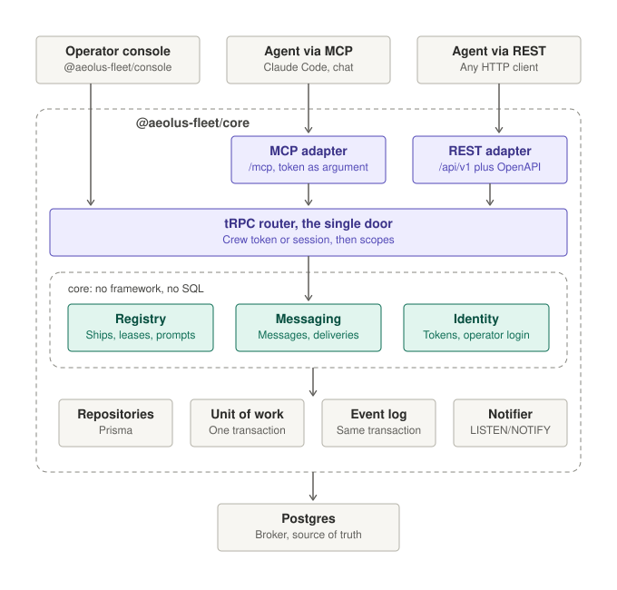
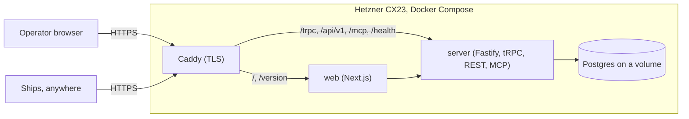
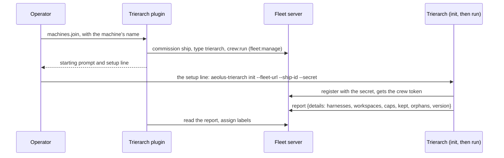
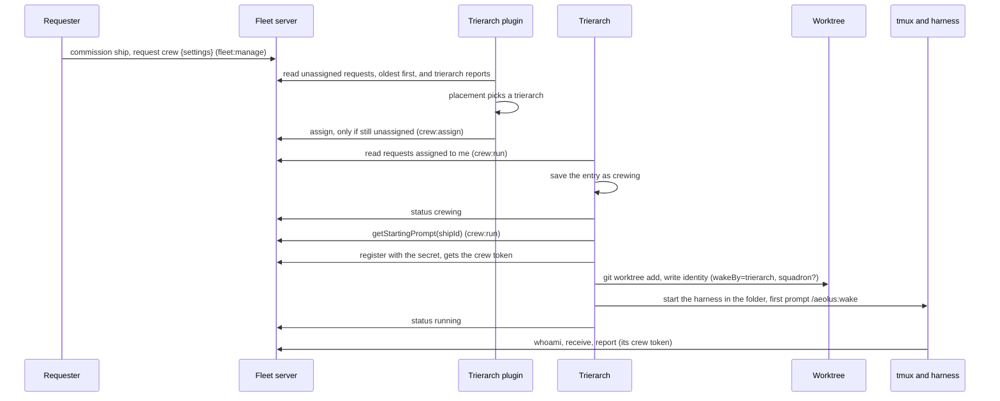
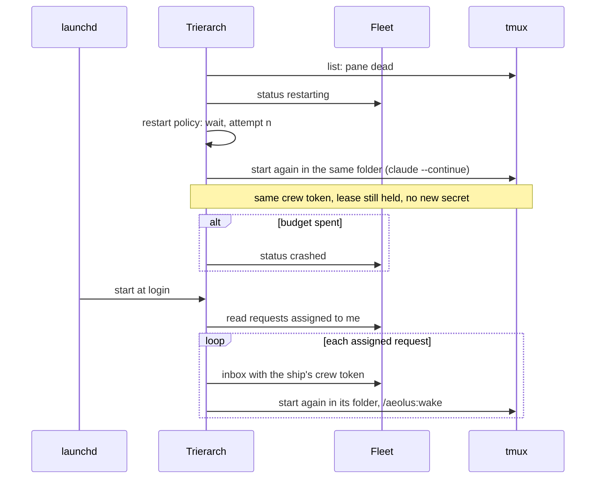
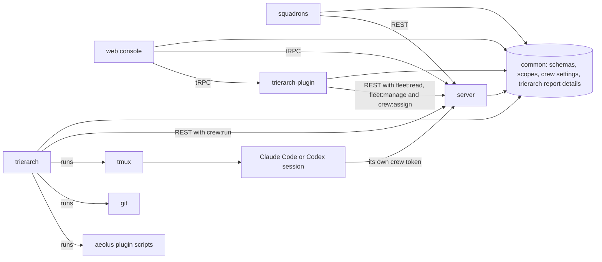

# Aeolus: solution and technical architecture (v0)

Owner: Thomas Hendrickx. Last updated 2026-10-07.

## Summary

Aeolus is three npm packages and one Postgres database. `@aeolus-fleet/core` exposes one API, a tRPC router, that every client uses: the operator web app, and ships through MCP or through REST generated from the same router. `@aeolus-fleet/console` is a Next.js operator console that calls only that API. `@aeolus-fleet/common` holds what both share: schemas, ids and types.

Inside the server, the three domain contexts from the blueprint (Registry, Messaging, Identity) are built as ports and adapters, so the domain never imports a framework or the database. Every record belongs to a fleet (the tenant), so one installation can later host several fleets at no extra cost.

The delivery guarantee lives in Postgres, not in application memory: a message is stored with its deliveries in one transaction before the sender gets an OK, and a delivery is claimed with row locks so two sessions can never take the same one. Postgres `LISTEN/NOTIFY` wakes waiting receivers and feeds live updates over WebSockets.

How it runs is not part of the product. Your own setup (Hetzner, Docker Compose, Caddy) lives in a separate private infra repository; anyone else can run the packages wherever they like, within the hosting constraints described under Deployment.

Companion document: [the product and domain blueprint](blueprint.md).

## Solution architecture

The server has exactly one API door: a tRPC router. The web app calls it like any other client, so there is no private back door for the console. For ships, the same procedures are also reachable as REST (with an OpenAPI spec generated from the router) and as MCP tools, so an agent gets identical behaviour whichever way it connects. Behind the door, the domain core is built as ports and adapters.

<picture>
  <source media="(prefers-color-scheme: dark)" srcset="images/architecture-dark.svg">
  
</picture>

### The router

| Procedure group | Authenticated by | Reachable as | Examples |
| --- | --- | --- | --- |
| Ship procedures | `register`: ship id and secret. Every other call: the crew token `register` returned (a header for tRPC and REST, a tool argument for MCP) | tRPC, REST, MCP | Register, whoami, receive, send, acknowledge, pong, report, report log, deregister |
| Fleet procedures | Crew token or console session, plus the `fleet:read` or `fleet:manage` scope; assigning a crew request and writing its reason take `crew:assign`; for the ships of crew requests assigned to the caller, reading one ship, getting a starting prompt, releasing, writing the status and confirming a release take `crew:run`, as does reading those requests; defining a label, changing its values and deleting it take `labels:define`, assigning and unassigning a value `labels:assign`, and reading the labels and finding a value `fleet:read` | tRPC; the fleet actions (list, ship, commission, get starting prompt, release, re-crew, retire, ping, follow, crew request, remove crew request, assign crew, explain crew request, report crew status, confirm crew release, assigned crew requests, labels, define label, change label values, assign label, unassign label, delete label, find label value) also REST (`/api/v1/fleet/<call>`) and MCP (`fleet_<call>` tools) for a crewed ship with those scopes | Commission, rename, release, retire, get starting prompt, request crew, remove a crew request, resend, dismiss, fleet snapshot |
| Console procedures | Email and password, then the console session cookie | tRPC | Sign in (starts a console session crewing `argo`), sign out, and `console.session`: another service's server forwards the browser's cookie and learns whether the operator or a viewer is signed in (fleet, expiry, kind and scopes, or `UNAUTHORIZED`), so it serves its pages beside the console without a login of its own |
| Installation procedures | The installation token, in the `x-aeolus-installation-token` header; never a crew token or console session | tRPC only | `installation.fleets.create`, `list`, `get`, `delete`: see Installation below |
| Live subscriptions | Console session | tRPC over WebSocket | Fleet snapshot changes, inbox changes, delivery state changes |
| Following the fleet | Crew token or console session, plus `fleet:read` | tRPC, REST (`/api/v1/fleet/follow`), MCP (`fleet_follow`) | `fleet.follow`: the events after an event number, the same numbers the live subscription sends, waiting up to 25 seconds while none has come, woken by the same `NOTIFY` |

Every caller is a ship, except a hosting service calling the installation procedures. A call is authorised by the caller's scopes, which live on the server with the ship; the console is simply `argo` holding every scope. The only procedures that exist purely for the web app are sign-in and live updates.

### Installation

One server may host many fleets for a hosting service such as pagasae (decision 0020; the behaviour and the four measures are in the blueprint, "Installation"). The service calls the installation procedures on the same tRPC router:

- **The token:** `INSTALLATION_TOKEN` (at least 32 characters) in the server's environment. Unset, every installation procedure answers `NOT_FOUND`, so a self-hosted server shows nothing new. Set, a request must present exactly that token in `x-aeolus-installation-token` (compared in constant time), or it is refused with `UNAUTHORIZED`. REST and MCP never serve these procedures.
- **Shapes:** every installation procedure's input and output is a schema in common: `schemas/installation.ts` (fleets, settings, limits, sign-in tickets), `schemas/notice.ts` and `schemas/guide.ts`. The bullets below say what each does, never its fields.
- **`installation.fleets.create`** creates a fleet and its argo, with the viewer ship when asked, and answers their ids; `CONFLICT` for an email an operator already has, or a request id used for another request.
- **`installation.fleets.list`** answers every fleet, oldest first; **`installation.fleets.get`** answers one, or `NOT_FOUND`. Each with its operator, its four measures, its messages per UTC day for the last 7 days, and the limits that apply.
- **`installation.settings.get`** and **`installation.settings.set`** read and write the default ship limit, the default daily message limit and the fleet cap, each a whole number or none, kept in `installation_settings` (one row, none until set). **`installation.fleets.limits`** and **`installation.fleets.setLimits`** read and set a fleet's limits (columns on `fleets`); a set writes FleetLimitsChanged.
- **`installation.notices.get`** and **`installation.notices.set`** read and replace the notices, in order (decision 0023). Kept in `notices` (no fleet, no event). The console reads **`console.notices`**, the notices of its session's audience less those it dismissed, and calls **`console.dismissNotice`**: `NOT_FOUND` for a notice the session does not see, `BAD_REQUEST` for one that is not dismissible, OK again for one already dismissed.
- **`installation.guide.get`** and **`installation.guide.set`** read and replace the one guide, or remove it (decision 0024). Kept in `guides` (one row or none, no fleet, no event). The console reads **`console.guide`**, its steps and the session's progress, or none when no guide is for its session's audience, and calls **`console.recordGuideProgress`** (`open`, `skipped` or `finished`): `NOT_FOUND` when no guide is for the session, `BAD_REQUEST` for a step the guide does not have.
- **Enforcement:** commission (`SHIP_LIMIT_REACHED`), send, reply, ping and resend (`MESSAGE_LIMIT_REACHED`), and `installation.fleets.create` (`FLEET_LIMIT_REACHED`) answer `FORBIDDEN` with a message naming the limit. Where a limit applies, the count is taken under a per-fleet advisory lock (the installation-wide lock for the cap) held until the new row is stored, so racing calls never overshoot it; with no limit nothing is counted or locked. The console reads `fleet.limits` (`fleet:read`): each limit with its count, and when the daily count starts again.
- **`installation.fleets.delete`** deletes a fleet; `NOT_FOUND` for a fleet the installation does not host.
- **`installation.operators.issueSignInTicket`** issues a ticket for the operator, by default, or the viewer (`NOT_FOUND` for a viewer ticket of a fleet without the viewer ship): one use, valid 2 minutes, stored as its hash, with whom it signs in, in `sign_in_tickets` (a fleet's table, deleted with it); writes SignInTicketIssued. The hosting service sends the browser to the console's `/sign-in/ticket?ticket=...`; the web app's server redeems it with `console.redeemSignInTicket` (no console origin: the ticket is the credential), passes the session cookie on and redirects to `/`. A used, expired or unknown ticket answers `UNAUTHORIZED`, and the console shows `/sign-in/failed`, linking back to `AEOLUS_HOSTED_SIGN_IN_URL`.
- **Request ids:** `installation_requests` keeps one row per create and delete, by request id, with the request's hash. A create's row names the fleet and argo it answered with and is deleted with that fleet; a delete's row names nothing of the fleet.
- **Delete:** one transaction deletes every row with the fleet's `fleet_id`, children first. Events stay append-only through a trigger; the one exception is this transaction, which names the fleet in the transaction-local setting `aeolus.deleting_fleet`, so only that fleet's events may go.

### Use cases (inbound ports)

| Context | Use cases |
| --- | --- |
| Registry | Initialise fleet (creates `argo`), commission ship, rename ship, register session (claim lease), release ship, re-crew ship (release and a new starting prompt in one transaction), retire ship (removing its crew request), request crew, remove a crew request (releasing it when assigned), assign crew (optimistic claim), explain a crew request (the reason it can not be placed), report crew status, confirm a crew release and read a trierarch's assigned crew requests (decision 0029), define a label, change its values, delete it, assign and unassign its values, list the labels and find a value's ids by its texts (decision 0031; a retire retires the labels its ship owns and removes those it carries), issue starting prompt (core issues the secret only; the tRPC adapter presents the prompt, one crew line per harness and the secret, decision 0019), list fleet (all ships, or those carrying every label value given), get one ship |
| Messaging | Send message, receive deliveries, check the inbox (count what the next receive would hand the crew, claiming nothing), acknowledge delivery, ping a ship and answer a ping with pong, resend or dismiss undeliverable, mark a message to `argo` read or done |
| Shared (read models) | Read the fleet's events after a position (live updates); read a ship's timeline (events naming it or caused by it), its messages (sent, sent to it, or claimed by it as a ship of their type) and one message with its delivery's history from the event log |
| Identity | Verify crew token (returns ship, fleet, kind and scopes), console sign in with email and password (takes `argo`'s lease over), sign out, reset operator password (server command), verify console session |

### Outbound ports

| Port | Purpose | v1 adapter |
| --- | --- | --- |
| Repositories per aggregate (Ship, CrewRequest, Label, Message, Delivery, Credential, OperatorAccount, ConsoleSession) | Load and store aggregates, always scoped to one fleet | Prisma on Postgres |
| `UnitOfWork` | Run a use case in one database transaction | Prisma interactive transaction |
| `EventLog` | Append domain events: timeline, audit, live updates | Postgres table, written in the same transaction |
| `Notifier` | Wake receivers and live subscriptions after commit | Postgres `LISTEN/NOTIFY` |
| `SecretHasher`, `PasswordHasher` | Hash ship secrets, crew tokens and session tokens (SHA-256); hash the operator password (Argon2id) | Node crypto for both (`crypto.argon2` for Argon2id) |
| `Clock`, `IdGenerator` | Time and prefixed ids, injectable so tests are deterministic | System clock, id library |

The cross-context calls, Messaging asking Registry to resolve a selector, check that a ship is not retired, name a delivery's sender, hold a crew's lease during a receive, find a crewed ship to ping and mark a lease seen on pong, go through a Registry port, never through Registry's tables.

## Deployment

The product is the npm packages; how they run is up to whoever installs them. Your own setup lives in a separate private infra repository: one Hetzner CX23 running Docker Compose with Caddy, the `core` and `console` processes, and Postgres on a volume. Every client, operator or ship, connects outward over HTTPS, so a ship can run anywhere that reaches the server.



| Path | Served by | Used by | What |
| --- | --- | --- | --- |
| `/` | web | Operator | The Next.js console |
| `/trpc` | server | Web app, TypeScript clients | The tRPC router, including WebSocket subscriptions |
| `/api/v1` | server | Ships | REST generated from the ship procedures, with an OpenAPI spec whose description opens with the ship protocol |
| `/api/v1/docs` | server | Operator, ship builders | The ship REST API as a readable page (Scalar), rendered from the OpenAPI spec at `/api/v1/openapi.json`. Its assets are served by the server, not a CDN, and the page talks only to the fleet's own server |
| `/mcp` | server | Ships | The ship procedures as a remote MCP server (streamable HTTP), with the ship protocol as its instructions. The connection carries no ship identity; each conversation registers and passes its crew token in the tool arguments (decision 0015) |
| `/health` | server | Monitoring | Server up and database reachable. Nothing about fleets |
| `/health` (web) | web | Monitoring | Web up and the server's health, and with `AEOLUS_SQUADRONS_URL` or `AEOLUS_TRIERARCH_PLUGIN_URL` set, that plugin's own part (`squadrons`, `trierarchPlugin`) from its `/api/health` (`up` with its connection, or `down`). A plugin down shows in its part and does not fail the whole. Nothing about fleets |
| `/version` | web | Operator, monitoring | The live versions: the web process's own, plus the server process's own answer from `/api/version` (`server: null` when it does not answer) and, with `AEOLUS_SQUADRONS_URL` or `AEOLUS_TRIERARCH_PLUGIN_URL` set, that plugin's own answer from its `/api/version` (`squadrons` or `trierarchPlugin`, null when it does not answer; no part when unset). Each process reports what it runs, so a deploy that failed halfway shows. No authentication, no fleet data. Caddy routes `/version` to web |
| `/api/version` | server | The web app's `/version` | The server process's own version, the version of the common package it loaded, and the latest migration applied to the database |

Only ports 80 (redirect) and 443 are open, and the fleet is reachable over public HTTPS: ship secrets carry the security. Postgres listens on the Compose network only. Estimated cost stays as in the blueprint: about €12.50 a month including VAT.

### Running elsewhere

Anyone can run the packages on other hosting, within two constraints that come from the design:

| Package | Hosting requirement | Works on |
| --- | --- | --- |
| `console` | Any Next.js host | Vercel, any Node host, a container |
| `core` | A long-running Node process: it holds WebSockets, long-poll receives and a `LISTEN` connection. Serverless functions cannot do this | Any VM or container host (Fly.io, Railway, Render, a VPS); not Vercel functions |
| `squadrons` (optional) | A long-running Node process with its own Postgres database (it may share the fleet's Postgres server), serving every fleet of the server with one connection each, switched per fleet by a hosting service with squadrons' own installation token (decision 0021), and no files of its own: it reads template repositories from `api.github.com`. It needs no public address: only the web app's server and the fleet's API talk to it or it to them, and it calls out to GitHub | Any VM or container host, next to the server |
| `trierarch-plugin` (optional) | A long-running Node process beside squadrons, with a small Postgres database of its own holding only each fleet's connection and switch (it may share squadrons' Postgres server, in its own schema), serving every fleet of the server with one connection each, switched per fleet as squadrons is (decisions 0021, 0030). It needs no public address: only the web app's server and the fleet's API talk to it or it to them | Any VM or container host, next to the server |
| `trierarch` (optional) | A long-running Node process on the machine where the sessions it crews run, kept alive by launchd or a systemd user unit, with its files under the operator's home folder. It needs no public address: it calls the fleet's API | The operator's own machine (a Mac, a Linux host) |
| Database | Postgres 16 or newer, with a direct connection for `LISTEN/NOTIFY` (a transaction pooler breaks it) | Supabase or Neon via their direct or session connection, any managed Postgres |

## Technology choices

The stack mirrors your other projects (Next.js, tRPC, Prisma), with the few additions a long-running broker needs. All decided.

| Layer | Choice | Note |
| --- | --- | --- |
| Runtime | Node.js 26, TypeScript, npm workspaces | Node 26 becomes the LTS line in October 2026 |
| API | tRPC, one router for every client | The web app uses it directly; ships use it through REST or MCP |
| REST for ships | Generated from the ship procedures, with an OpenAPI spec | For ships that are not TypeScript or not MCP-capable |
| MCP | Official MCP TypeScript SDK, streamable HTTP, tools mapped onto the same procedures. Ship identity per conversation through the crew token argument, never through the connection | Mounted in the server process |
| Server host | Fastify with the tRPC adapter and WebSocket support | Mature tRPC integration, including subscriptions over WebSocket |
| Web app | Next.js (App Router), React, shadcn/ui on Base UI, tRPC client with TanStack Query | Same pattern as Hemma; talks only to the server's router |
| Database access | Prisma with Prisma Migrate | The row-locking claim query and `LISTEN/NOTIFY` are written as typed raw SQL inside the Postgres adapter; the core never sees them |
| Queue | Own tables with row locks | Deliveries are domain objects with their own states and history; no job library |
| Validation | Zod schemas in `common` | One schema per message shape for tRPC, REST, MCP and web forms |
| Live updates | tRPC subscriptions over WebSocket, fed by `LISTEN/NOTIFY` | Possible because the server is a dedicated long-running process |
| Operator auth | Email and password (Argon2id) for one operator account. Sign-in gives a random session token, stored as SHA-256, sent as an httpOnly secure cookie, valid 30 days after last use. The session crews `argo`; `argo` has no secret. No auth library | Decision 0012 |
| Ship auth | Opaque secret `aeolus_sk_v1_…`, stored as SHA-256, used only to `register`; `register` returns a crew token `aeolus_ct_v1_…`, stored as SHA-256 with the lease, which every later call carries as a bearer token | Decisions 0002, 0015 |
| Ids | Prefixed, time-ordered ids (`flt_`, `shp_`, `msg_`, `dlv_`, `evt_`, `lse_`, `crd_`, `ses_`) with a lowercase ULID body | Every id shows what it refers to and sorts by creation time |
| Logging | pino, structured JSON to stdout | Never logs secrets or payloads |
| Tests | Vitest; integration tests on a real Postgres (Testcontainers); Playwright for the web app | The guarantee lives in SQL, so it is proven against a real Postgres |
| License | Apache-2.0 | Includes an explicit patent grant |

## How the delivery guarantee is implemented

Every promise in the blueprint maps to one Postgres transaction. Nothing the guarantee depends on is held only in memory, so a crash of the Node process loses nothing.

### Core tables

Every table except `fleets` and the installation's `installation_requests`, `installation_settings`, `notices` and `guides` carries a `fleet_id`, and every uniqueness rule is per fleet. Every foreign key has an index leading with its columns, so deleting a referenced row (deleting a fleet deletes all of its rows) checks the rows that reference it with an index, never a scan. A self-hosted server creates one fleet at first run; a hosting installation creates more through the installation procedures.

| Table | Holds | Key constraints |
| --- | --- | --- |
| `fleets` | The tenant: name, created date, the number of its last committed event, and how its ship and daily message limits are set (its own, null for none, or the installation default) | One row on a self-hosted server |
| `ships` | Name, type, kind (`operator`, `agent` or `viewer`), scopes, note, retired date; for an agent ship, the ship that commissioned it, its idempotency key and the request's hash | Name unique per fleet among ships that are not retired (partial unique index); exactly one `operator` ship per fleet, named `argo`; at most one `viewer` ship per fleet, named `viewer`; an idempotency key unique per commissioning ship |
| `crew_requests` | A ship's crew request (decision 0029): its settings (JSONB, at most 16 KB, stored without meaning), their version (one more on every request), when they were last requested, the trierarch ship it is assigned to, its status (crewing, running, restarting, crashed, releasing) with the restart attempt and when the session started, and the trierarch plugin's reason while unassigned | At most one per ship: the ship's id is its key; the assignee is a ship of the same fleet, indexed for a trierarch's query; removed with its ship's retire |
| `worktree_clear_requests` | A pending clear request (decision 0032): the trierarch ship, the worktree by the ship it belonged to and its repository, who asked and when | One per trierarch, ship and repository (the primary key with the fleet); every ship is of the same fleet. A request locks the trierarch ship first, so two never both pass its limit; removed with its trierarch's retire |
| `labels` | A label (decision 0031), id `lbl_`: its key and the ship that owns it. A retired or deleted label's row is deleted; its events stay | The key is unique per fleet; the owner is a ship of the same fleet, indexed for a retire. Defining takes an advisory lock on the fleet and the key |
| `label_values` | A label's values (at most 50), id `lbv_`: the label, the value and its place in the label's order. A value keeps its row, and so its id, while the label has it | A value once per label; the label is one of the same fleet |
| `ship_labels` | The values each ship carries: ship, label and value | One row per ship and value (the primary key with the fleet), so a ship holds a set; the label and the value are of the same fleet, indexed for a change of values, a delete and a retire. The ship is locked first, then the label: an assignment holds the label (`FOR SHARE`) and reads it again after the lock, a change of values and a delete lock it (`FOR NO KEY UPDATE`) and a retire of its owner (`FOR UPDATE`), so none of them crosses another |
| `leases` | Which ship is crewed, since when, its crew's last call (every authenticated call by its crew token, or by argo's console session, marks it in the statement that authenticates it; observation only), the hash of its crew token, the session's location (`DEVICE`, `CLOUD`, `SERVER`, `OTHER` plus a description), the harness it stated (none for argo's console lease), and its crew's report: state, note, when it last reported, details (JSONB, at most 16 KB, decision 0028) and their version | At most one open lease per ship (partial unique index); the crew token hash is unique across all fleets, so the crew token lookup is not scoped by fleet either |
| `credentials` | Hashed ship secrets, issued, claimed and invalidated dates | At most one valid secret per ship (partial unique index); the hash is unique across all fleets, which makes the secret lookup one of the queries that are not scoped by fleet |
| `messages` | Sender ship, selector, payload, content type, the model the sender's session stated (none from argo, for pings, and before models were stated; a resend keeps the original's), sender's idempotency key, hash of the request it was sent with (selector as sent, payload, content type, in-reply-to), optional in-reply-to and resend-of message | Payload at most 64 KB (serialized bytes); in-reply-to names a message in the same fleet; unique on sender plus idempotency key; a repeat of the key must match the request hash (the model is no part of it); indexed on sender and time, for a ship's current model |
| `deliveries` | Recipient ship or recipient type, state (including dismissed), claimed-by ship and lease, attempts (the claims so far), read date for messages to `argo` | One row per recipient; indexed on fleet, recipient and state, and on the claiming lease; an in-flight or acknowledged delivery names the ship and lease that claimed it, a pending one neither; the claiming lease belongs to the same fleet |
| `events` | Append-only log of every state change: type, time, actor ship (or system), ship, message and delivery it concerns, small details, and its number in the fleet's stream | Never updated or deleted: timeline, audit trail and live-update source; the number is unique per fleet, in commit order without gaps |
| `operators` | The operator account: email, Argon2id password hash (none for an operator a hosting installation created), the console theme (light, dark, system; system until chosen) | Email unique across the installation (looked up before the fleet is known); one operator in v1 |
| `installation_settings` | The installation's default ship and daily message limits for fleets and its cap on fleets, each null for no limit | One row at most; belongs to no fleet (decision 0020) |
| `notices` | The installation's notices: id, place in its order, audience (`everyone`, `operators`, `viewers`), text, links, whether dismissible | At most 5 (checked where they are set); belongs to no fleet (decision 0023) |
| `installation_requests` | The installation's creates and deletes of fleets, by the caller's request id, with the request's hash; a create also names the fleet and argo it answered with | The one table that belongs to the installation, not to a fleet (decision 0020): a create's row goes with its fleet, a delete's names nothing of the fleet |
| `console_sessions` | Console sessions crewing `argo` or the viewer ship: ship, token hash, the device it signed in from (from the sign-in's User-Agent: "Mac · Chrome"; also argo's lease location, as OTHER), the lease it holds (none for a viewer session), last used, expiry, how long it stays valid after use, the time it ends by at the latest (viewer sessions only), and why it ended (taken over by a sign-in elsewhere, signed out, password reset) | At most one live session holding a lease per fleet (signing in ends the previous one); only an ended session has a reason |
| `notice_dismissals` | Which notices a console session dismissed, and when | One row per session and notice; no foreign key to `notices`, so replacing the notices keeps dismissals of an id that comes back |
| `guides` | The installation's guide: its audience and its steps (path, anchor, title, text) | One row or none; belongs to no fleet (decision 0024) |
| `guide_progress` | Where a console session is in the guide: its step, and open, skipped or finished | One row per session, replaced on each move; no foreign key to `guides` |

A message is the travelling ticket, not the cargo. The 64 KB limit is deliberate: real content lives where it belongs (a repo path, a pull request, a storage URL), and the payload carries the reference plus the instruction.

### The four operations

1. **Send.** In one transaction: verify the sender, resolve the selector (a ship by id or name that is not retired, or a type with at least one active ship), insert the message and its delivery, append the event, and queue a `NOTIFY` for the recipient. Postgres releases the notification only when the transaction commits, so no receiver is ever woken for a message that does not exist. Only after the commit does the sender get OK. A repeated send with the same idempotency key and the same request returns the original message instead of a new one; the same key with a different request is refused.
2. **Receive.** In one transaction: select up to the ship's `max` (1 to 10, default 1): first this crew's own unacknowledged in-flight deliveries, then the oldest pending deliveries for this ship, or for its type, with `FOR UPDATE SKIP LOCKED`, mark them in flight, record the claim and increase the attempt count (a returned in-flight delivery counts as a claim too, so a lost reply is recovered without the operator). Each comes with its message and its sender's id, name and type, read in the same transaction, so a renamed sender goes by its new name. `SKIP LOCKED` is what makes it impossible for two ships of the same type to claim the same delivery. The transaction holds the crew's lease (`FOR SHARE`): a release or takeover ending it waits, then returns what the receive claimed, so nothing stays claimed by an ended lease. When nothing is pending, the call waits on `LISTEN` for up to about 25 seconds and then returns empty (long poll). A delivery that is claimed a fifth time without ever being acknowledged becomes undeliverable instead.
3. **Acknowledge.** A single guarded update: the delivery moves to acknowledged only if it is in flight and claimed by the calling ship. Acknowledging twice is harmless and returns OK.
4. **Release** (operator) **and deregister** (the ship itself). Only a crewed ship other than `argo`; a crew deregisters only its own lease. In one transaction, locking the ship, then its secret, then its lease: invalidate the secret, close the lease and with it the crew token, and return the deliveries the lease held in flight to pending, their attempts kept, queueing a `NOTIFY` for each as a send does. Direct deliveries go back to the ship's inbox; type deliveries lose their claim and go back to the type queue, where a waiting receive of another ship of the type takes one at once. Events: `CredentialRevoked`, `LeaseRevoked` (caused by the operator or the ship) and one `DeliveryReturned` per returned delivery; every other lease end (sign-in takeover, sign-out, password reset) writes `DeliveryReturned` and its `NOTIFY` too. A receive holding the lease makes the release wait, then the release returns what the receive claimed. A receive waiting on an empty inbox holds no lock while it waits, so it never holds a release up, and once the lease has ended it hands out nothing. Retiring does the same, then marks the remaining direct pending deliveries abandoned (one `DeliveryAbandoned` each, with `ShipRetired`) and the ship retired; an undeliverable one stays for the operator. Type deliveries are never abandoned by a retire, because other ships of that type can still take them.

Resend and dismiss (operator, from Needs attention) each lock the undeliverable delivery first, so they take turns. A dismiss sets it to dismissed with `DeliveryDismissed`; dismissing it again is OK and changes nothing. A resend then locks its idempotency key (`resend-<delivery id>`, the original sender's) and the ship it is addressed to, as a send does, and in one transaction stores a new message with `resend_of` the original, its pending delivery and `MessageAccepted`, sets the original to dismissed with `DeliveryDismissed` (both events caused by `argo`), and queues the `NOTIFY`. A second resend finds the key and answers the same message.

The operator inbox (argo only, through its console session, whose caller carries the lease the session holds on `argo`): mark read sets the delivery's read date, keeping an earlier one, or clears it, with no event. Mark done holds the session's lease (`FOR SHARE`, as a receive does) and locks the delivery, then claims and acknowledges it at once, one claim counted, writing `DeliveryClaimed` and `DeliveryAcknowledged`; again is OK. Reply sends as a send does (the key, then the sender's ship, held against a retire) and then marks the message done in the same transaction, the acknowledgement naming the reply in its details; any refusal rolls both back.

Ping (`fleet.ping`, `fleet:manage`): in one transaction, lock the ship (`FOR UPDATE`, so two pings of one ship take turns), hold its open lease (`FOR SHARE`), refuse `argo`, a retired ship or one awaiting crew, then look for the ship's open ping (a message with the content type `application/vnd.aeolus.ping` whose delivery is pending or in flight). If there is one, answer with it and store nothing; otherwise send a new one as a send does, with a fresh idempotency key. `send` refuses that content type for every caller, so pings exist only this way. Pong locks the ping delivery, acknowledges it as `ack` does with `answer: pong` in the event's details, and marks the crew's lease last seen, in one transaction. A resend refuses a ping (`PING_NOT_RESENT`): it is dismissed, and the ship pinged again.

The same event rows feed three things at once: ship and message timelines, the audit trail, and live updates to the web app (through `NOTIFY` and tRPC subscriptions over WebSocket).

## The trierarch

Two processes, each its own package, crew ships on machines: the trierarch plugin, beside squadrons, assigns crew requests; a trierarch on each machine crews the ships assigned to it. What they do is in [trierarch.md](trierarch.md); decisions 0026, 0027, 0029 and 0030 say why. The crew request itself lives in the fleet core (decision 0029). The server never imports either and knows nothing about them beyond their ships.

### The trierarch plugin

`@aeolus-fleet/trierarch-plugin`: a long-running Node process, hosted beside squadrons, serving every fleet of the server with one connection each and switched per fleet as squadrons is (decisions 0021, 0030). It reaches each fleet only through the public API, as that fleet's trierarch plugin ship (`fleet:read`, `fleet:manage`, `crew:assign`, `labels:define` and `labels:assign`). It follows the fleet's changes, and every check-in returns the latest full state. Its own small database holds per fleet only the connection (its ship and kept crew token) and the switch, set through installation procedures as squadrons' are; it may share squadrons' Postgres server, in its own schema. Everything else (requests, statuses, machines) lives in the fleet. It depends on `common` only.

| Layer | Pieces |
| --- | --- |
| Core (pure) | **Placement**: a pure function from (the unassigned requests, oldest first, the trierarchs' reports, the requests assigned to each) to the trierarch to claim for each, or the reason none fits; the only place that picks. It keeps the trierarchs that fit (repository, harness, model) and have room, then takes the most room as a percentage, then the oldest. **Join**: commission a trierarch ship with `crew:run` and answer its starting prompt and the machine's setup line. **Machines**: the fleet's ships of type `trierarch`, each with its trierarch's report and details, and whether it is silent. **Assignment pass**: per fleet, read the unassigned requests and the trierarchs, place, then claim or write the reason; a lost claim is read again on the next pass. **Attention**: which trierarchs are silent, their last seen older than a threshold |
| Ports | **FleetClient**, per fleet: read crew requests and trierarch reports, claim an assignment or write the reason none fits (`crew:assign`, the claim refused when no longer unassigned), commission a ship and get its starting prompt (`fleet:manage`), assign labels. **ConnectionStore**: per fleet, the switch and the trierarch plugin ship's crew token. **Clock**, **Logger** |
| First adapters | REST for the fleet, as squadrons. Prisma for ConnectionStore, with its own migrations. tRPC for the web app's server, checked with the console session cookie through `console.session`, as squadrons |

### The trierarch on a machine

`@aeolus-fleet/trierarch` is a Node command, `aeolus-trierarch run`, kept alive by the operating system: a launchd agent on macOS, a systemd user unit on Linux. It depends on `common` only.

#### Parts

| Layer | Pieces |
| --- | --- |
| Core (pure) | **Reconciler**: a pure function from (assigned requests, saved state, observed, now) to actions (crew, launch, relaunch, stop, wake, release, remove workspace, write status, report), the only place that decides. **RestartPolicy**: waits 5 s, 30 s, 2 min, then 10 min, with a budget of 5 restarts an hour, after which the request is crashed. Entry states: crewing, running (idle or busy), restarting, crashed, releasing |
| Ports | **FleetClient**: the trierarch's own crew (its assigned requests, writing their status, and its report with details) and its `crew:run` calls (getStartingPrompt, release), `register` with a secret, and `inbox` and `report` with a session's crew token. **HarnessAdapter**, one per harness: describe (its options as a JSON Schema and what it needs on the machine), prepare identity (through the aeolus plugin's own `aeolus-identity.sh`, never a copy of how the plugin names its files), the launch command, the turn state (idle or busy), and wake. **ProcessSupervisor**: start, stop, list, send text. **WorkspaceAdapter**: prepare, is clean, remove. **StateStore**: entries saved as crewing, kept worktrees, runtime state per ship. **Clock**, **Logger** |
| First adapters | REST for the fleet. tmux for processes (one tmux session per ship, named after its ship id, kept on exit so an exit is seen). git worktree for workspaces (the repository fetched first, a ref resolved to its `origin` branch when there is one), plus a configured folder used as it is. Claude Code for harnesses (`claude` in the folder, the prompt before the flags, `--remote-control` named `[<repository or folder>] <ship>` when the operator gave it without a name, `--continue` on a restart; wake types `/aeolus:wake` when the plugin's turn marker says idle). Codex too (`codex` in the folder, the prompt before the flags, always `--no-daemon` so the session owns its work (trierarch.md, "Release"), `codex resume --last` on a restart, which resumes the folder's last conversation; wake types `$aeolus-wake` and a space, so the skill picker leaves Enter alone, and waits a second before Enter, since Codex takes an Enter right after fast typing as part of a paste). Each harness gets its own adapter and the aeolus plugin it installed (Claude Code's or Codex's plugin cache and data folder); a configured harness with no adapter stops the trierarch at start |
| Local configuration | Caps (ships, running), harnesses offered, repositories by name, the worktree root, folders usable as they are, and launch flags per harness (for example `--dangerously-skip-permissions`, `--remote-control`, the model), overridable per setup. No policy: the operator may put skip-permissions in a harness's flags, and the trierarch never adds a flag by itself (`init` asks, and the answer is no unless the operator says yes). Settings pick named options only; they never add a flag or carry a path. The report's details show the effective flags |

Every adapter that only runs a program or speaks HTTP lives in this package (tmux, herdr, a child process; claude-code, codex, pi; git worktree, folder). An adapter gets its own package only when it needs a vendor SDK or runs somewhere else.

#### Files on the machine

Everything of the trierarch lives under `~/.aeolus/trierarch/`.

| What | Where | Written by |
| --- | --- | --- |
| Configuration, JSON with a `$schema` line, checked by the same schema in `common` | `~/.aeolus/trierarch/config.json` (or `--config`, `AEOLUS_TRIERARCH_CONFIG`) | The operator |
| The configuration's JSON Schema, for an editor | `~/.aeolus/trierarch/config.schema.json` | `aeolus-trierarch init` |
| The fleet's URL, the trierarch's own ship id and its crew token, mode 600 | `~/.aeolus/trierarch/crew-token` | `aeolus-trierarch init` |
| State: entries saved as crewing, kept worktrees, runtime state per ship. No secrets and no declared state (the fleet holds that); written atomically | `~/.aeolus/trierarch/state.json` | The trierarch |
| The running trierarch's pid and version, so `status` tells the running version from the installed one | `~/.aeolus/trierarch/running.json` | The trierarch, as it starts |
| Logs | `~/.aeolus/trierarch/logs/` | The trierarch |
| Worktrees, one folder per ship: `<root>/<repository>/<ship>` | `~/.aeolus/trierarch/worktrees/` (the configuration's worktree root overrides it) | The trierarch |

Each session's crew token lives only in the aeolus plugin's identity file for its folder, as for any crewed folder.

`aeolus-trierarch init` is the whole setup, asking for what is missing (the fleet URL, ship id and secret, which the setup line the trierarch plugin gave for this machine passes as flags; the secret without echo when asked): it registers, writes the configuration, answers Claude Code's one-time questions in Claude Code's own files (`hasTrustDialogAccepted` in `~/.claude.json` for the worktree root, which covers every folder under it, and for each configured folder, and, when the sessions skip permissions and the operator agrees, `skipDangerousModePermissionPrompt` in `~/.claude/settings.json`), answers Codex's when the configuration offers Codex (through `codex app-server`, as Codex's own dialogs do: each configured repository and folder trusted in `~/.codex/config.toml`, since trusting a repository covers its worktrees but a parent folder covers no repository under it, and the aeolus plugin's new or changed hooks trusted with the hash Codex gives them), and offers to install the service. It asks about Codex only where `codex` runs or Codex is configured already. On a machine set up already it never registers again. `status`, `list` and `logs` read the machine (the state, tmux, the service, the log); `status` calls `whoami` once for the lease, and reads `running.json` for the version the service runs. `start`, `stop`, `restart`, `install` and `uninstall` drive the service, and `upgrade` installs a pinned version and restarts it, leaving the sessions to the new process; `uninstall` deletes no worktree and none of the trierarch's files. Every command answers JSON with `--json`. The package README lists them.

### A machine joins



### A crew request and its first crew



The secret lives only in the trierarch's memory, between getting the starting prompt and registering.

### A session dies, and the machine restarts



### A delivery for an idle ship, and release

```mermaid
sequenceDiagram
  participant S as Sender
  participant R as Requester
  participant F as Fleet
  participant T as Trierarch
  participant X as Session
  participant W as Worktree
  S->>F: send to ship
  T->>F: inbox wait with the ship's crew token
  F-->>T: waiting 1
  alt session idle
    T->>X: wake (Claude Code: /aeolus:wake; Codex: $aeolus-wake)
  else busy
    T->>T: wake once when it turns idle
  end
  X->>F: receive, ack, work, reply
  R->>F: remove crew request (fleet:manage): releasing
  T->>F: read requests assigned to me: releasing
  T->>X: stop the session
  T->>F: release(shipId) (crew:run)
  alt worktree clean
    T->>W: remove worktree and identity
  else changes
    T->>W: keep the folder, remove the identity, report it kept
  end
  T->>F: confirm: the request is gone
```

One wake per rise in the waiting count, and nothing more until the session has received.

### Dependencies



Every arrow is code or an API call: no fleet message carries crew state. The trierarch plugin and the trierarch never call each other; they meet in the fleet's crew requests and reports.

### What the aeolus plugin does for it

The identity file of a folder a trierarch crews says `wakeBy=trierarch`. The plugin then asks for no watcher of its own: the SessionStart and Stop hooks and the watcher guard leave waking to the trierarch. A turn marker (busy or idle, with when), written by the plugin's UserPromptSubmit and Stop hooks, tells the trierarch when a session may be woken, in Claude Code and Codex alike. `/aeolus:wake` (Codex: `$aeolus-wake`) is both the first prompt and the wake. In Codex the plugin arms no wake bridge of its own for such a folder.

## Code structure

Seven parts. The first six are npm packages under the `aeolus-fleet` organisation, in one public Apache-2.0 repository (`squadrons`, `trierarch-plugin` and `trierarch` are optional). The seventh is your private setup and consumes the packages like any other installer would.

| Part | Where | Contains | Depends on |
| --- | --- | --- | --- |
| `@aeolus-fleet/common` | Public repo, `packages/common` | Zod schemas for every procedure, prefixed id helpers, shared types, error codes, event names | Nothing but Zod |
| `@aeolus-fleet/core` | Public repo, `packages/core` | Domain core, use cases, ports; adapters for Prisma, tRPC, REST, MCP, WebSocket; start command | `common` |
| `@aeolus-fleet/console` | Public repo, `packages/console` | The Next.js operator console, built with atomic design: shadcn/ui on Base UI as atoms, composed into molecules (StatusBadge, SelectorPicker, StartingPromptBlock), organisms and page templates. The Claude Design canvas is the visual reference; behaviour comes from the blueprint | `common`, and the server's router type (type-only) |
| `@aeolus-fleet/squadrons` | Public repo, `packages/squadrons` | Forms squadrons of ships from blueprints and leads them (decision 0017): its own core, ports and Prisma adapter, its own database and migrations, the fleet's public REST API as its management ship (`fleet:read`, `fleet:manage`), and GitHub's REST API for the template repositories, with no clone and no files on disk. Optional | `common` |
| `@aeolus-fleet/trierarch-plugin` | Public repo, `packages/trierarch-plugin` | The trierarchs' plugin on the server side (decision 0030): its own core and ports, the fleet's public REST API as its ship (`fleet:read`, `fleet:manage`, `crew:assign`, `labels:define`, `labels:assign`), tRPC for the web app's server, and a Prisma adapter with its own small database and migrations (each fleet's connection and switch). Optional | `common` |
| `@aeolus-fleet/trierarch` | Public repo, `packages/trierarch` | Crews ships on its machine from the crew requests assigned to it (decision 0026): its own core and ports, adapters for the fleet's REST API (as its own ship, with `crew:run`), tmux, git and the harnesses, and its command `aeolus-trierarch`. Optional | `common` |
| Infra | Private repo `aeolus-fleet-infra` | Docker Compose, Caddyfile, environment, backup scripts, deploy workflow for Hetzner | The published packages |

Layers, not folders (the code shows the folders):

- `core/src/domain`: domain, use cases, ports, per context (`registry`, `messaging`, `identity`, `shared`). Other contexts import a context only through its `public.ts`.
- `core/src/adapters`: everything that touches a technology (Prisma, tRPC, HTTP, CLI, crypto, REST, MCP). Depends on `src/domain`, never the reverse. REST and MCP go through the tRPC router.
- Composition: the server's entry points build the adapters and inject them into the use cases.
- `console`: reaches the server only through the tRPC router and imports only its type. Components follow atomic design.
- `squadrons/src/core` and `squadrons/src/adapters` follow the same split; squadrons reaches the fleet only through the fleet's public API, never its tables.
- `trierarch-plugin/src/core` and `trierarch-plugin/src/adapters`, and `trierarch/src/core` and `trierarch/src/adapters`, follow the same split; each reaches the fleet only through its public API.
- Every repository call takes a fleet scope (exception: decision 0007).

Lint and CI enforce these rules (slice 1b).

## Cross-cutting concerns

| Concern | Approach |
| --- | --- |
| Tenancy | Every record belongs to a fleet. A ship secret, a crew token or a console session resolves to exactly one ship and fleet (the lookups that are not scoped by fleet), and the API sets that fleet scope before any use case runs. v1 has one fleet; hosting several is a data change later |
| Configuration | Environment variables (database URL, public URL), validated into one typed config object at startup. A bad config stops the process with a clear message. The web app reads the server's address when it runs and passes it to the browser, never at build time, so one published build serves any fleet |
| Running from npm | Each package has a `bin` command for what an operator runs: `aeolus-core start`, `migrate`, `fleet:init` and `operator:reset-password`; `aeolus-console start`. The infra repo installs a pinned version and runs these, knowing nothing of the source |
| Migrations | Prisma Migrate, run at startup (`aeolus-core start`) under a Postgres advisory lock so two starting processes never migrate at once; also available as a separate command (`aeolus-core migrate`) |
| First run | A server command initialises the fleet: it creates the fleet, `argo` and the operator account, asking for email and password. There is no setup page on the public web |
| Forgotten password | A server command resets the operator password and ends every console session |
| Signed out | The web app's server checks every console page request's session with `console.session` before it renders, and redirects one without a live session at once: to `AEOLUS_HOSTED_SIGN_IN_URL` when set, to `/sign-in` otherwise. Nothing of the console shows first. When the server does not answer the check, the page renders and the console sends the browser to sign in as soon as a call is refused |
| Console across hosts | The server sets the session cookie for a configured domain and allows a configured console origin (CORS with credentials), so web and server may run on different hosts under one domain. Unset, the console origin is the public URL's |
| Time | All timestamps stored as UTC; the web app shows local time |
| Payloads | Text with a content type (any well-formed media type, passed on untouched; `text/plain` when the sender gives none), at most 64 KB, never parsed by the core. Content travels by reference |
| Live updates | Event ids are taken before their transaction commits, so they are not in commit order. Each event therefore also gets a number per fleet: a unit of work writes its events as its last statements, taking their numbers from its fleet's row, whose lock it holds until commit, so a lower number always commits first and there are no gaps. Its `NOTIFY` names the fleet and the last number. The `fleet.events` subscription (tRPC over WebSocket on `/trpc`, from the console's origin only) sends each event with its number as the tracked id; a reconnecting browser sends back the last number it applied and the server replays the rest from the `events` table. A browser without a number, or more than 1000 behind, is told to load the fleet again and follow from the number given. A notice is only a wake-up: the table is the truth, so a listener that reconnects loses nothing |
| Security baseline | Public HTTPS only; secure httpOnly SameSite cookies plus an origin check: sign-in, sign-out and every change made with the session cookie come only from the console origin, since hosts under one domain are one site; rate-limited sign-in and failed `register` attempts; every call checked against the caller's scopes; secrets, crew tokens and payloads never logged; no error response carries a stack trace; server failures return a generic message with a request id, and the full error is logged under that id; no text input holds U+0000: one check at the API door refuses it as a bad request |
| Observability | Structured logs to stdout, a `/health` endpoint, and the events table as the full history |
| Testing | Unit tests on the core with in-memory adapters; integration tests on a real Postgres; the v1 acceptance test end to end (two ships exchange messages over MCP; one is released mid-delivery, the message is claimed again, nothing is lost); a Playwright smoke test for the console |
| CI and release | GitHub Actions: lint, typecheck, tests on every push. Releases publish the published packages (decision 0008) to npm with trusted publishing (the same OIDC setup as Tiphys) and tag the released commit `v<version>`, so a version on npm always matches a tag in git. Container images are your infra repo's concern, not the product's |
| Versioning | Ship REST lives under `/api/v1`; every published package is released together with one semantic version. Before 1.0.0, breaking changes are allowed |

## Decision record

| Decision | Outcome |
| --- | --- |
| Web app framework | Next.js, as in your other projects |
| Database access | Prisma, with typed raw SQL for the locking and notify queries |
| API style | tRPC as the single API; REST and MCP generated or mapped from the same procedures |
| Live updates | WebSockets (tRPC subscriptions) |
| Packages | `core`, `console` and `common` as separate npm packages; infra in a separate private repo |
| Runtime | Node.js 26 |
| Tenancy | Built in from the start: every record belongs to a fleet |
| Id format | Prefixed, time-ordered ids |
| Network exposure | Public HTTPS, kept simple for now |
| Payload size | 64 KB maximum; messages carry references, not content |
| License | Apache-2.0 |
| Repository | New public repo `aeolus-fleet`, plus private `aeolus-fleet-infra`. The packages stay in one repo while they share one version |
| Operator | The ship `argo`, crewed only through the operator's email and password login; scopes on the server |

Still open, deliberately later: heartbeats and wake-ups (likely a ship class concern), and operator-editable scopes.
