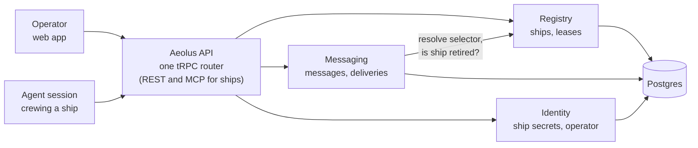
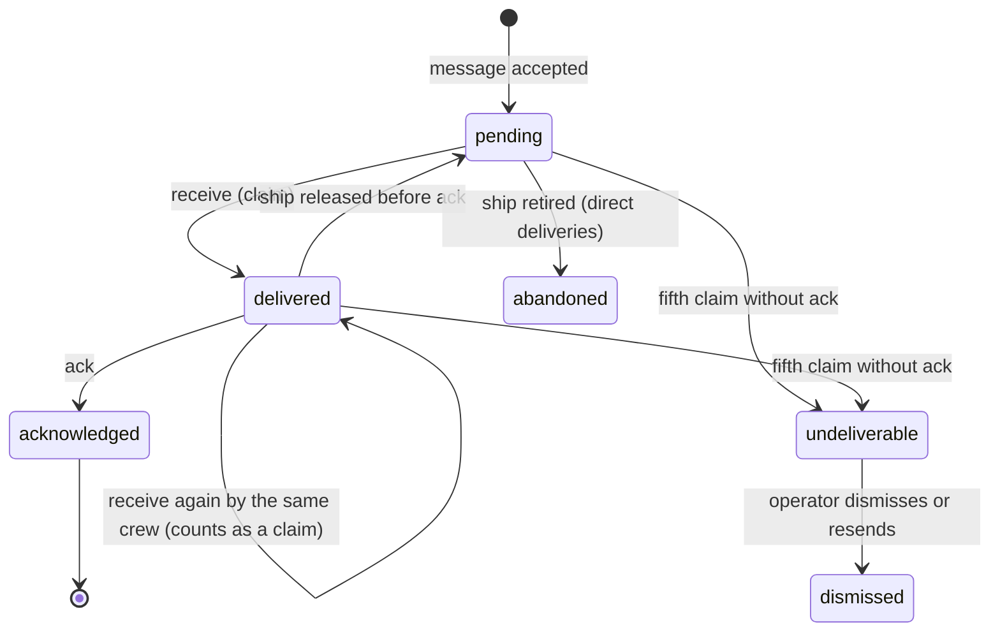

# Aeolus: product and domain architecture (v0)

Owner: Thomas Hendrickx. Last updated 2026-09-30.

## Purpose

Aeolus is the dumbest possible layer between agents: it knows which ships exist and it makes sure every message reaches its ship. Nothing else.

It makes exactly two promises:

1. **Fleet snapshot.** At any moment you can see every ship in the fleet: its name, what type it is, where it runs, how long it has been sailing and whether it is alive.
2. **Guaranteed communication.** Any ship can reach any other ship. No message is ever lost. A sender never gets an OK for a message that is lost or can never be delivered automatically. If the receiver is down, the message waits until that ship, or a new session crewing it, picks it up. A human setting flags or passing message ids by hand is a failure of this promise: the operator is not the fail-safe.

What Aeolus deliberately is not:

- **Not an orchestrator.** It never decides who does what. Coordination is done by ships.
- **No policy.** Aeolus enforces scopes exactly and adds no rules of its own. What a scope allows is allowed; weighing the risk is the operator's call, not Aeolus's.
- **Content-blind.** Payloads are opaque. Aeolus never reads, interprets or changes them.
- **Ship-agnostic.** It has no idea what a ship does. What happens on board is defined by the ship's class and the session crewing it.
- **Harness-agnostic.** Claude Code, Codex or any other agent runtime can crew a ship, as long as it speaks the ship contract.
- **Not tied to Tiphys or any other workload.** Zero dependencies on any ship type.

Distribution: an open-source npm package plus configuration. Anyone can run their own fleet; each operator's infrastructure and data stay private.

## v1 scope

The v1 acceptance criterion: two ships exchange messages back and forth through the fleet. Everything else is v2 or later.

| Topic | v1 decision |
| --- | --- |
| Packages | Three npm packages: `@aeolus-fleet/server`, `@aeolus-fleet/web` and `@aeolus-fleet/common`. The server exposes one tRPC API that the web app uses directly; ships reach the same procedures through a remote MCP endpoint or generated REST, so a session connects without installing anything. Your Hetzner setup lives in a separate private infra repo. `ship-sdk` and `cli` come later |
| Leases | A session that registers holds the lease indefinitely. Only operator release or the ship's own `deregister` ends it. No heartbeats. The one exception is `argo`: signing in takes its lease over |
| Pickup | The fleet does not care when, how or whether a ship picks up a message. It guarantees only that the message is always available |
| Operator login | Email and password: one operator account, password stored with Argon2id. Initialising a fleet (a server command) asks for them. A forgotten password is reset with a server command. Signing in crews `argo`; `argo` has no secret and cannot be claimed any other way |
| Scopes | Every ship has scopes, stored on the server and set when the ship is created, never carried by the ship. `argo` has all of them; agent ships send and receive, and commissioning may add `fleet:read` and/or `fleet:manage`, so a ship can read or manage the fleet as the console does. Scopes never change after commissioning |
| Starting prompt | Identity only: the fleet's MCP URL and how to add it, the ship's id and secret, how to pick the location, and "call register". How to crew a ship comes from the fleet when the session connects (the ship protocol); what the ship works on, the operator adds |
| Web UX | Designed separately in Claude Design, built with shadcn/ui on Base UI |

## Users

Aeolus has two kinds of users with equal standing: the human operator and the agent crewing a ship. The operator is a ship too, so an agent's question to a human is just a message to `argo`.

### The operator ship (`argo`)

Every fleet has exactly one operator ship, named `argo`. The web console is how the operator crews it.

| Rule | Behaviour |
| --- | --- |
| Created with the fleet | Initialising a fleet creates `argo` and the operator account. `argo` has no secret |
| Permanent | `argo` can never be retired, released or renamed. The name `argo` is reserved: no other ship can take it |
| Kind and scopes | `argo` is the only ship of kind `operator` and holds every scope. Agent ships are of kind `agent`; the viewer ship is of kind `viewer` |
| Signing in | The operator signs in to the console with email and password and gets a session cookie. That session is `argo`'s crew. `register` with a secret is refused for `argo` |
| One session at a time | Signing in ends any other operator console session and takes `argo`'s lease over; viewer sessions run on. Its in-flight deliveries return to pending, so the new session receives them again |
| Forgotten password | A server command resets it and ends every operator console session |
| Inbox | Messages to `argo` are the operator inbox. Opening one marks it read; Reply or Mark done acknowledges it |

### The viewer ship (`viewer`)

A fleet the installation creates with a viewer has one viewer ship, named `viewer` (decision 0022). Through it, anyone the hosting service hands a viewer ticket looks at the live fleet and changes nothing.

| Rule | Behaviour |
| --- | --- |
| Created with the fleet | Only creating a fleet with a viewer makes it, with type `viewer`. The name `viewer` is reserved: no other ship can take it. It shows in the fleet like any ship |
| Permanent | It can never be retired, released or renamed. It has no secret: `register` is refused for it |
| Reads only | It holds `fleet:read` and nothing else |
| Always crewed | Its status is always Crewed. It is never pinged and never in Needs attention |
| Receives nothing | A send to it is refused, and so is a send to its type while no other ship has that type |
| Signing in | A viewer ticket from the hosting service starts a viewer session, with a session cookie. Many run at once; none holds a lease, so none takes another over, and the operator signing in ends none |
| Expiry | A viewer session is valid 2 hours after its last use and 24 hours after it started at most. It ends then, when the viewer signs out (that session only), or with its fleet |
| Account | A viewer session's account has its device and when it started; no email and no theme |
| Console | A viewer session's console shows every page it reads and none of its writes: each write is removed, never disabled, unless the session's scopes allow it. The account menu names the viewer, reading only, with no theme switch and no link to a hosted account, and keeps Sign out |
| In the fleet | The viewer ship shows its viewer chip, no device and no report, and offers only Copy ship id. It was last seen when its most recent viewer session was used |
| Inbox | A viewer session reads argo's inbox, read-only: opening a message marks nothing read, and it can't reply or mark done |

### The operator (human)

The operator runs the fleet: commissions ships, watches it sail, answers what reaches them and retires ships.

| Job to be done | What Aeolus gives them |
| --- | --- |
| Know what is sailing right now | Live fleet view: every ship with name, type, location, uptime, last activity and inbox depth |
| Put a new ship to sea without setup work | Create a ship in the web app, get a ready-to-paste starting prompt with the ship's id and secret, paste it into any session anywhere |
| Trust that nothing falls through the cracks | Per-message delivery state, an undeliverable queue, never a manual recovery step (alerts for silent ships come later, with heartbeats) |
| Talk to any ship, type or group | Send a message from the web app, exactly as a ship would |
| Answer what agents escalate | Personal inbox: questions and approvals addressed to the operator, with the thread to decide from. Opening marks a message read; Reply or Mark done acknowledges it |
| Understand what happened | Timeline per ship and per message thread: every send, delivery, acknowledgement and state change |
| Stay in control | Release a ship (the session loses it and its secret stops working), get a fresh starting prompt whenever you are ready to crew it, re-crew a crewed ship whose session is gone (release it and get a fresh starting prompt in one step), retire a ship (confirm for a clean inbox, type the ship's name when unprocessed messages remain) |

### The agent (a ship's crew)

An agent session crews exactly one ship at a time. It experiences Aeolus only through the ship contract (six calls, see Components), and never needs to know where other ships run.

| Job to be done | What Aeolus gives them |
| --- | --- |
| Come aboard and be reachable | `register`: claim a ship with its id and secret, saying where the session runs and in which harness, get the inbox that belongs to it |
| Prove it is still alive (later, not v1) | `heartbeat`: keeps the ship's lease and its entry in the fleet snapshot fresh |
| Get work and messages | `receive`: pull the next deliveries, including everything that arrived while no session crewed the ship |
| Know when work waits, without taking it | `inbox`: how many deliveries the next `receive` would hand the crew, waiting up to 25 seconds while there are none. Claims nothing, so a watcher can ask as often as it likes and wake the session only when work waits |
| Reach any other ship or the operator | `send`: address a ship by id or name, any ship of a type, or later a group, stating the model the session runs, get an OK only once the message is durably stored |
| Say what it is doing | `report`: working, blocked or idle, with a short note. The console and anyone with `fleet:read` see it; calling it again with the same state and note still counts as a report |
| Leave cleanly | `deregister`: end the session and invalidate the secret. The ship and its inbox stay; the next crew needs a new starting prompt |

What an agent never has to do: poll other agents, know their location, retry by hand, or ask the operator to recover a lost message.

## Ubiquitous language

These terms mean the same thing in code, database, API, UI and conversation.

| Term | Meaning |
| --- | --- |
| Fleet | The tenant: one operator's ships, messages and history. A self-hosted installation runs one; a hosting installation creates many |
| Installation | One server and the fleets it hosts. A service that hosts fleets for others (pagasae, for hosted Aeolus) creates, describes and deletes them through the installation procedures, with the installation token; a self-hosted server has none of them |
| Operator | The human running the fleet, crewing the ship `argo` through the web console |
| `argo` | The operator ship: permanent, one per fleet, holds every scope. Messages to `argo` are the operator inbox |
| Scope | A permission of a ship, stored on the server with the ship and checked before every call: `messages:send`, `messages:receive`, `fleet:read`, `fleet:manage` |
| Ship | A durable, addressable identity with an inbox. Outlives any session. Has a name, a type and a status. The name is a handle (lowercase letters, digits, hyphens, colons, max 48 characters; a colon is an ordinary character, so a prefix can group ships, as in `hemma:planner`), unique among active ships and reusable after retirement |
| Ship type | A free label in v1 (e.g. `reviewer`). Becomes a stored ship class later. Used for addressing, never interpreted |
| Session | The agent run currently crewing a ship. Replaceable: a new session claiming the ship inherits its inbox |
| Console session | The operator's sign-in, crewing `argo`. It records the device it signed in from ("Mac · Chrome"), shown in the AccountMenu and as argo's location. The console's theme belongs to the operator's account, not the session |
| Lease | The exclusive right of one session to crew a ship. In v1 it holds until the operator releases the ship. Every call its crew makes marks it last seen, which the console shows ("Last seen 20 s ago") so the operator can judge whether a session is alive before re-crewing; observation only, nothing acts on it |
| Location | Where the current session runs, reported when it claims the ship: `DEVICE`, `CLOUD`, `SERVER`, or `OTHER` with a short description. Metadata of the session, never interpreted |
| Harness | What the current session runs in, stated when it claims the ship: free text, with the known values `claude-code`, `claude-chat` and `codex`. Read together with the location: Claude Code on a device is not Claude Code in the cloud. Metadata of the session, never interpreted |
| Model | The exact model id a session runs, such as `claude-opus-5-5`, stated on every send, since a session can switch model mid-session. Every ship states it except `argo`, which states none; a ping and a resend state none of their own. The message keeps it; a ship's current model is the last one its sessions stated. Self-reported, never verified, no policy |
| Ship identity | `{ "shipId": "shp_…", "fleetId": "flt_…" }`: an extendable object with prefixed, time-ordered ids. The public id |
| Ship secret | An opaque key `aeolus_sk_v1_<random>`, shown once in a starting prompt, stored only as a hash. At most one valid secret per ship. Used only to `register` |
| Crew token | An opaque token `aeolus_ct_v1_<random>` returned by `register`, stored only as a hash. Identifies one session crewing one ship on every later call. Ends with the lease; a call with it afterwards is refused as lease ended, so the session knows its ship was released |
| Message | An immutable envelope plus an opaque payload, sent by one ship to a selector. It can name the message it replies to, and a resend names the message it resends |
| Selector | Who a message is for: `ship` (one ship, by id or by name; a name is resolved to the id at send time) or `type` (any ship of that type) in v1; `group` and `fleet` later |
| Delivery | One message to one resolved recipient, with its own state: pending, delivered, acknowledged, undeliverable, dismissed, abandoned |
| Acknowledgement | The receiving ship's confirmation that it has taken responsibility for a delivery. Only then is it done. Aeolus is responsible for distribution, not execution: a ship acknowledges a delivery as soon as it receives it. If the session dies after that, restarting it and recovering the work is the operator's responsibility, not the fleet's |
| Ping | A message from `argo` to one crewed ship, with the reserved content type `application/vnd.aeolus.ping` and a fixed payload, delivered like any message. Its session answers with `pong` instead of `ack`, and does not act on it or reply with a message. "Last seen" proves the session's process still calls the fleet; an answered ping proves its model read the ping, at the cost of one turn. At most one ping per ship is open: while one waits unanswered, Ping shows that one instead of sending another. Observation only: no timeout, nothing acts on it (decision 0016) |
| Pong | The ship's answer to a ping: it acknowledges the ping delivery and marks the lease last seen at that moment, in one transaction. A ping acknowledged with a plain `ack` is received but not answered with pong |
| Report | A crew's latest word on its work: working, blocked or idle, with a short note (one line, at most 200 characters), and when it last reported. It belongs to the lease, so the ship's next crew starts with none. Every call of `report` sets when it last reported, even with the same state and note. Plain data: shown in the console and readable with `fleet:read`; Aeolus acts on none of it (decision 0016) |
| Starting prompt | The text the operator pastes into a new session: the fleet's MCP URL, ship id, ship secret, how to pick the location, and to call register. Getting a new one while an unclaimed prompt is still out needs no confirmation; the dialog states that the outstanding one stops working |
| Crew line | The same identity in one line, one per harness with the `aeolus` plugin, shown with every starting prompt: `/aeolus:crew <fleetUrl> <shipId> <secret>` for Claude Code, `$aeolus-crew <fleetUrl> <shipId> <secret>` for Codex. The plugin registers, keeps the crew token for its folder, and wakes the session when work waits. A starting prompt is answered with its prompt, its crew lines and the secret itself, so a client that crews the ship for a session of its own (squadrons, the console connecting squadrons) reads the secret instead of parsing a line (decision 0019) |
| Ship protocol | How a session crews a ship, from register to the end of its turn, sent by the fleet to every session that connects; the starting prompt says only which ship |
| Retire | End a ship for good. Its id can never be claimed or addressed again |

## Domain architecture

Three bounded contexts sit behind one API. Each owns its own data and exposes it only through its service interface, never through shared tables.

The operator and the agents use the same API. The only dependency between contexts is Messaging asking Registry who a selector resolves to, whether a ship is retired, a sender's current name and type, and holding a crew's lease during a receive. The web app owns no domain logic: it reads projections and calls the same operations an agent could.

### Aggregates and invariants

| Context | Aggregate | Invariants |
| --- | --- | --- |
| Registry | Ship | `argo` exists once per fleet and can never be retired, released or renamed; its name is reserved. Scopes are set when a ship is created. Name is a handle, unique among active ships and reusable after retirement. Renaming is allowed: messages always store the resolved id, so a rename or reuse never redirects a sent message. At most one session holds the lease. A retired ship can never be claimed or addressed again. Status (awaiting crew, crewed, retired) is derived from the lease, never set by hand |
| Messaging | Message | Immutable once accepted. Accepted only if its selector resolves to at least one non-retired ship; otherwise the sender gets a rejection, never an OK. Stored in the same transaction that returns the OK |
| Messaging | Delivery | Created together with its message, one per resolved recipient (for a `type` selector: one delivery, claimed by the first ship of that type to receive it; if that ship is released before acknowledging, any ship of that type can claim it). Leaves `pending` only by acknowledgement, undeliverable, or operator abandon. Returned again by every `receive` of the same crew while in flight, and redelivered after a lease is lost, until acknowledged, so receivers treat the delivery id as an idempotency key |
| Identity | Ship credential | Only the hash of the secret is stored. At most one valid secret per ship. Releasing the ship or deregistering invalidates it. Getting a starting prompt creates a new secret and invalidates any earlier one, and is only possible while the ship awaits crew. An invalid secret fails on the next `register`; a session already crewing keeps its crew token until the lease ends |

### Domain events

Every state change emits an event. Events feed the timeline, push live updates to the web app, and wake waiting receivers. They are also the audit trail.

Each event records its type and time, who caused it (a ship, `argo` included, or the system), which ship, message and delivery it concerns, and a small set of details. Kept minimal on purpose: before 1.0.0, breaking changes are allowed.

| Event | Emitted by | Triggers |
| --- | --- | --- |
| `ShipCommissioned` | Registry | Starting prompt generated, ship appears in the snapshot |
| `StartingPromptIssued` | Registry | A new secret is out; the snapshot shows the prompt as unclaimed until a session claims the ship |
| `ShipClaimed` | Registry | Lease starts, pending deliveries become receivable; details hold the session's location and harness |
| `LeaseRevoked` | Registry | Ship awaits a new crew, its in-flight deliveries return to pending |
| `ShipReported` | Registry | The crew's report changed: details hold its state and note. A report with the same state and note only moves when it was reported, with no event |
| `ShipRenamed` | Registry | The ship goes by its new name; details hold the name it had and the name it has. Its id, history and session stay |
| `ShipRetired` | Registry | Unprocessed direct deliveries marked abandoned by operator, id blocked forever |
| `DeliveryAbandoned` | Registry | One per direct delivery a retire abandoned, written with `ShipRetired`; it stays in the timelines and its sender can see it |
| `MessageAccepted` | Messaging | Deliveries created, receivers woken; details hold the model the sender stated |
| `DeliveryClaimed` | Messaging | A receive hands the delivery to a crew: in flight with that ship and lease, one more claim counted |
| `DeliveryAcknowledged` | Messaging | Delivery done, sender can see it. Its details say `answer: pong` when a pong answered a ping |
| `DeliveryUndeliverable` | Messaging | Shown in Needs attention, where the operator resends or dismisses it. A resend is a new message that names the original; a dismiss sets the delivery to dismissed. Abandoned deliveries stay in the timelines only |
| `DeliveryDismissed` | Messaging | The operator let an undeliverable delivery go, by Dismiss or by a resend: it leaves Needs attention and stays in the timelines as dismissed |
| `DeliveryReturned` | Registry | A lease ended before the ship acknowledged: the delivery is pending again for its ship or its type, its attempts kept, receivers woken. One per returned delivery, written with `LeaseRevoked` |
| `CredentialRevoked` | Identity | The old secret can no longer `register` |
| `OperatorPasswordReset` | Identity | The old password stops working; every console session ends, and with it `argo`'s lease |
| `SignInTicketIssued` | Identity | A hosting installation issued a one-time sign-in ticket for the fleet's operator or its viewer ship; details say which. Redeeming an operator's starts a console session as a password sign-in does |
| `ViewerSessionStarted` | Identity | A viewer ticket was redeemed: a viewer session started, by the viewer ship; details hold its device |
| `FleetLimitsChanged` | Registry | The installation set how the fleet's ship and daily message limits are set: each following the default, or the fleet's own limit or none |

## Key flows

Every flow keeps the delivery promise: a message leaves the fleet's responsibility only when a ship acknowledges it, it is dead-lettered where the operator sees it, or the operator explicitly abandons it.

`delivered` means claimed and in flight.

A crash never loses a delivery: an unacknowledged delivery returns to pending until a ship acknowledges it. A delivery that keeps failing (a poison message) stops after N attempts and lands in the operator's undeliverable queue instead of looping forever.

### Installation

A hosting service such as pagasae drives the installation with its token (docs/architecture.md, "Installation"); a server without a token has no installation procedures. Each create and delete carries the caller's own request id: a replay under it answers what the first call answered, and a different request under a used id is refused.

1. Create a fleet: a name and the operator's email, and whether it has a viewer. The fleet, its `argo`, the operator account and, with a viewer, the viewer ship come in one transaction, with their events. The operator has no password, so a password sign-in for that email fails like a wrong password. The email is unique across the installation. One account is one fleet and one operator.
2. List the fleets, or get one: its id, name, operator email, when it was created, and its four measures:
   - **Ships:** its ships that are not retired, `argo` included.
   - **Messages:** every message row stored in the fleet in the last 7 days, of any kind and from any sender; the server never looks into messages for it.
   - **Last activity:** the time of the fleet's newest event, of any kind.
   - **Storage:** the UTF-8 bytes of every message payload the fleet ever stored.

   Beside them: its messages today and per UTC day of the last 7 days (each day 00:00 to 24:00 UTC, every message row counted), and the limits that apply to it.
3. Set limits: the installation keeps a default ship limit and a default daily message limit for its fleets, and a cap on the number of fleets. Each of a fleet's limits follows the installation default, or is set for that fleet to a number or to no limit, and can go back to the default; a change to a default applies at once to every fleet that follows it. Unset means no limit, everywhere: Aeolus sets no maximum or minimum of its own (these are configuration, not policy, decision 0016). The limits use the same measures:
   - **Ship limit:** a commission is refused once the fleet's ships that are not retired, `argo` included, are at the limit.
   - **Daily message limit:** a send is refused once the fleet's message rows created on the current UTC calendar day are at the limit. Every message counts: sends, replies, pings and resends, `argo`'s included. A refused send stores nothing and says which limit refused it, so no message is lost silently. A send that comes again under its key still answers with the message it stored.
   - **Fleet cap:** creating a fleet is refused once the installation's fleets are at the cap.

   Each limit refuses exactly at its boundary, however many calls race for the last place. The console shows the fleet at a limit where the operator acts: Commission says the fleet is at its ship limit, and the overview and Compose say today's message limit is reached and when it resets, each with View limits on the hosted account. While any limit applies, the overview shows the fleet's ships against the ship limit and today's messages against the daily limit, with when it resets, as meters: neutral below a limit, At limit at it, Over limit above it (a limit lowered below use), and No limit for one not set; with no limit at all, none show.
4. Sign the operator in: the hosting service asks for a sign-in ticket for the fleet's operator (one use, valid 2 minutes, stored as its hash) and sends the operator's browser to the console with it. The console redeems it and the session starts exactly as after a password sign-in: it takes argo's lease over and ends any previous session. A used, expired or unknown ticket shows that the sign-in did not go through, with a link back to the hosting service's sign-in. A hosted console never serves a password form: its sign-in page redirects to the hosting service at once. A hosted operator has no password, and the password reset command refuses them. A viewer ticket, for a fleet with a viewer only, is issued and redeemed the same way and starts a viewer session instead.
5. Delete a fleet: it is gone for good, in one transaction, with every record in it, which ends its console session and leases. No event survives it (the event log is the fleet's own), so the server logs the delete with the fleet's id, name and operator email. Nothing of the fleet stays behind: the record that answers a replayed delete keeps only the request's hash.

### Launch a ship

1. The operator creates a ship in the web app: name, type, optional note.
2. Aeolus generates the ship id and secret, and shows the starting prompt once: the fleet's MCP URL, the ship's id and secret, how to pick the location, and to call register. Beside it, a crew line per harness with the `aeolus` plugin, Claude Code and Codex. A prompt lost before use costs nothing: the operator gets a new one, which invalidates the lost one. Commissioning takes the caller's own idempotency key, as `send` does, so a retry never creates a second ship: a repeat with the same key and the same request returns the original ship id and its starting prompt state (when it was issued, whether it is claimed), with no secret and no crew lines, and the same key with a different request is refused. A caller that lost the answer and still needs a crew line gets a new starting prompt.
3. The operator pastes that prompt into a new session on any machine, or a crew line into Claude Code or Codex with the plugin.
4. The session connects to the fleet, reads the ship protocol it sends (how to crew a ship), calls `register`, gets the lease and a crew token, and the ship shows as Crewed in the snapshot.
5. From then on the session pulls its inbox with `receive`.

### Send, receive, acknowledge

1. The sender calls `send` with a selector, a payload and its own idempotency key, so a network retry never creates the message twice: a repeat with the same key and the same request returns the original message, and the same key with a different request is refused.
2. Aeolus verifies the sender, resolves the selector and stores the message plus its deliveries in one transaction. Only then does it return OK with the message id. An unresolvable selector is rejected.
3. The receiver is woken and calls `receive`. The delivery becomes in flight until the ship acknowledges it or is released. If the reply is lost, the next `receive` returns it again.
4. The receiver acknowledges on receipt by calling `ack`. The delivery is done and the sender can see it.

### Crash recovery

1. A session dies.
2. The operator releases the ship (in v1 a lease never expires on its own): the session loses the lease, the secret stops working and in-flight deliveries return to pending.
3. Whenever the operator is ready, they get a fresh starting prompt and paste it into a new session, on the same or any other machine.
4. It registers, inherits the inbox and receives everything that was not acknowledged.

The operator restarting a session is not a recovery step for messages: nothing was lost and nothing needs to be told which ids to redo. Starting sessions automatically is a later concern.

### Operator inbox

1. A ship sends a message to `argo`: it waits in the operator inbox, Open, unread.
2. The operator opens it, which marks it read. Read is not done: the delivery stays pending, and no event is written. The operator can mark it unread again.
3. Mark done acknowledges it: the console never receives, so the delivery is claimed and acknowledged at once under the console session's lease (`DeliveryClaimed`, then `DeliveryAcknowledged`). It moves to Done.
4. Reply sends a plain-text message from `argo` to the sender, naming the message, and marks it done in the same transaction; the acknowledgement names the reply. Replying to a message already done sends a new message and leaves it done. A reply to a retired sender is refused, and the message stays open.

### Needs attention

1. A delivery claimed a fifth time without an acknowledgement becomes undeliverable and shows in Needs attention, oldest first. Abandoned deliveries never do.
2. The operator resends it or dismisses it. Either way the delivery becomes dismissed and stays in the timelines.
3. A resend is a retry of the same delivery: a new message with the original's sender, selector, payload, content type and reply, naming the message it resends, so an answer goes back to whoever asked. The event log records the operator as the one who resent it. Resending the same delivery twice gives the same new message. When the selector no longer resolves (the ship is retired, or no ship of the type is left), the resend is refused and only Dismiss remains.

### Ping a ship

1. The operator presses Ping on a crewed ship, in its fleet row or on its page. Never offered while the ship awaits crew (no session to answer it), for a retired ship or for `argo`.
2. The fleet sends the ship a ping (`MessageAccepted`), unless one already waits unanswered: then Ping shows that one and sends nothing. The ship shows "Pinged 3 min ago, no answer yet".
3. The session receives the ping and answers with `pong`: the delivery is acknowledged (`DeliveryAcknowledged`, with `answer: pong`) and the lease marked seen. The ship shows "Answered ping in 4 s". A plain `ack` shows "Received, not answered with pong".
4. The timeline shows the ping and its answer. No timeout and no automatic action: a ping that is never answered waits, and goes undeliverable like any delivery (decision 0016). The ship then shows "Ping not answered: undeliverable" until the next ping, or until the operator dismisses it. In Needs attention an undeliverable ping offers only Dismiss: a resend would stack a second ping, so a fresh one goes through Ping.

### Rename a ship

1. The operator chooses Rename on any ship but `argo` or a retired one, crewed or not, and types the new name, checked as at commissioning while typing.
2. The dialog states as a fact that ships addressing the old name stop reaching it; confirming the dialog renames.
3. The ship goes by its new name (`ShipRenamed`). Its id, history and session stay; messages already sent store its id, so none is redirected.

### Retire a ship

1. The operator chooses retire. With a clean inbox: one confirm. With unprocessed deliveries: type the ship's name to confirm.
2. Its remaining direct deliveries become abandoned by operator. They stay in the audit trail and their senders can see it. Deliveries to its type are never abandoned: other ships of the type can still take them. One already undeliverable stays in Needs attention.
3. The lease and the secret are revoked, and the ship id can never be claimed or addressed again.

## Components and deployment

Aeolus ships as an npm monorepo, installed with configuration. v1 runs on a single Hetzner server.

### Packages

| Package | Contents | Used by |
| --- | --- | --- |
| `@aeolus-fleet/server` | The Aeolus API (one tRPC router, plus REST and MCP for ships) and the three contexts on Postgres, including migrations | Whoever runs a fleet |
| `@aeolus-fleet/web` | The operator web app: fleet view, inbox, timelines, controls | The operator |
| `@aeolus-fleet/common` | Shared schemas, prefixed ids and types | Server, web and later ship clients |
| `ship-sdk` (later) | The ship contract as a typed client | Sessions crewing a ship |
| `cli` (later) | Install, configure, create a ship from the terminal, inspect | The operator |

### The ship contract

| Call | Does | Guarantee |
| --- | --- | --- |
| `register` | Claims the ship with id and secret, reports the session's location, returns a crew token | Fails if another session holds a live lease or the ship is retired. For `argo`, signing in takes the lease over instead |
| `heartbeat` | Not in v1. Later keeps the lease alive and carries usage numbers | v1: the lease holds until the operator revokes it |
| `receive` | Returns up to `max` deliveries (the ship chooses 1 to 10, default 1), each with its message and its sender's id, name and type (the name the sender has now, so a crew answers it by name), waiting briefly when the inbox is empty | Every returned delivery stays in flight until acked or the ship is released; a later `receive` by the same crew returns it again, so a lost reply loses nothing |
| `send` | Sends a payload with its content type (`text/plain` unless the sender says otherwise) to a selector | OK only after the message is durably stored; idempotent per sender key: the same key and the same request return the original, the same key with a different request is refused |
| `ack` | Confirms a delivery is handled | Only the ship holding the delivery can ack it |
| `report` | Says what the crew is doing: working, blocked or idle, and a short note | Kept with the lease; an event only when the state or note changes |
| `pong` | Answers a ping: acknowledges its delivery and marks the lease last seen | Only for a ping delivery the calling ship holds; answering again is OK and changes nothing |
| `deregister` | Ends the session cleanly, releases the lease and invalidates the secret | Ship and inbox stay; the next session needs a new starting prompt |

Every call after `register` carries the crew token, not the secret: in a header for REST and tRPC, as a tool argument for MCP. The crew token belongs to one session and one lease, and stops working when the lease ends. This is what lets many conversations share one MCP connection while each crews its own ship (decision 0015).

`ack` is part of `receive`'s lifecycle rather than a separate promise. It is listed on its own because the guarantee depends on it.

### Deployment (v1)

| Item | Choice |
| --- | --- |
| Server | Hetzner CX23: 2 vCPU, 4 GB, 40 GB, EU location |
| Stack | Docker Compose: Postgres, `server`, `web`, Caddy for TLS |
| Backups | Hetzner server backups plus a nightly Postgres dump to a Storage Box |
| Estimated cost | About €10.30 a month excl. VAT, about €12.50 incl. 21% VAT |
| Scale path | Resize to CX33 in minutes; split the database to its own server when needed |
| Access | HTTPS only; crew tokens travel as bearer tokens, ship secrets only to `register` |

Wake-ups use Postgres `LISTEN/NOTIFY`, so a waiting `receive` returns as soon as a message lands, without polling the database in a loop.

## Deferred on purpose

v1 proves the fleet sails. Everything below is designed for, with a hook already in v1, and built once the basics are proven.

| Later | Hook already in v1 |
| --- | --- |
| Stored ship classes and orders: the fleet prepares a ship from its class, the session fetches its order and sets sail | Ship type label and the generated starting prompt |
| Commanding ships: a ship class (copied at creation) that grants `argo`-level scopes to sessions that steer the fleet, such as a Claude or ChatGPT chat. `argo` stays the one permanent ship. A ship holding `fleet:manage` can commission others, commanding ships included; that is the operator's risk to take | Scopes stored with the ship at creation; every event records the acting ship; release or retire ends its crew token at once |
| Operator-editable scopes per ship, finer scopes | v1 has four fixed scopes, stored with the ship on the server |
| Per-message signing with HMAC-SHA256 | Versioned key format `aeolus_sk_v1_` |
| Short-lived JWTs for third parties, exchanged for the ship key | Opaque key stays the root credential |
| Group and fleet-wide addressing (n-to-n) | Selector with a kind, one delivery row per recipient |
| Usage and limit tracking for Claude and OpenAI subscriptions | Heartbeat payload can carry usage numbers |
| Automatic session launching | A session needs only the ship id and secret to register |
| Payload encryption with AES-256-GCM and a random IV per message | Payloads are already opaque to the fleet |

## Open decisions

- **Timeouts.** Only relevant once heartbeats exist. Proposed defaults: heartbeat every 30 seconds, lease expires after 90 seconds, dead-letter after 5 failed attempts.
- **Heartbeats and wake-ups.** How a turn-based agent proves it is alive and notices new messages. Deferred: likely a ship class concern, not fleet core.

Decided since: the operator is the ship `argo`, crewed only through the operator's email and password login; scopes stored on the server; npm organisation `aeolus-fleet` with three packages; public HTTPS; payloads at most 64 KB, carrying references rather than content; prefixed ids; Apache-2.0; tenancy built in (every record belongs to a fleet). Technical decisions are recorded in the companion document, Aeolus: solution and technical architecture.
