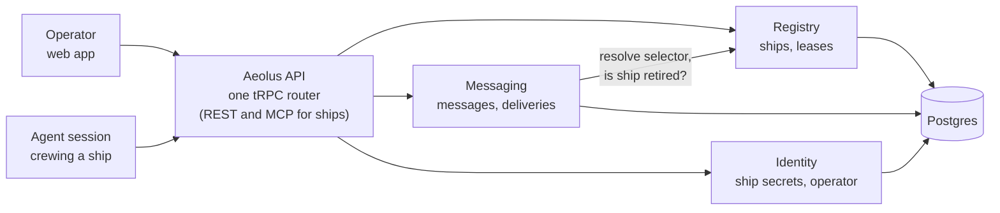
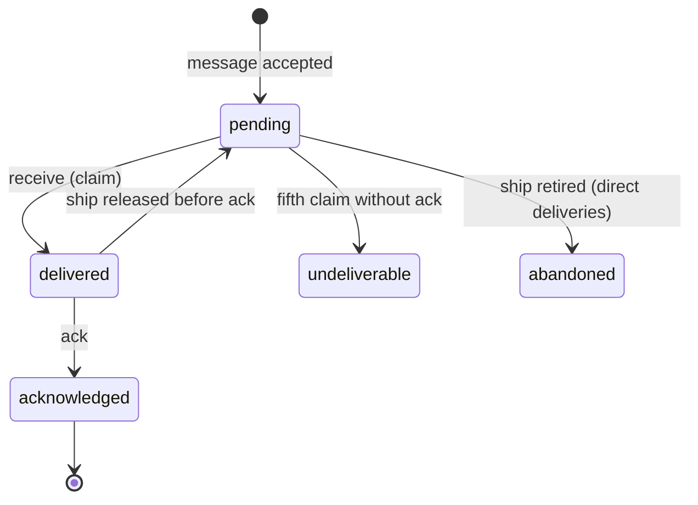

# Aeolus: product and domain architecture (v0)

Owner: Thomas Hendrickx. Last updated 2026-09-29.

## Purpose

Aeolus is the dumbest possible layer between agents: it knows which ships exist and it makes sure every message reaches its ship. Nothing else.

It makes exactly two promises:

1. **Fleet snapshot.** At any moment you can see every ship in the fleet: its name, what type it is, where it runs, how long it has been sailing and whether it is alive.
2. **Guaranteed communication.** Any ship can reach any other ship. No message is ever lost. A sender never gets an OK for a message that is lost or can never be delivered automatically. If the receiver is down, the message waits until that ship, or a new session crewing it, picks it up. A human setting flags or passing message ids by hand is a failure of this promise: the operator is not the fail-safe.

What Aeolus deliberately is not:

- **Not an orchestrator.** It never decides who does what. Coordination is done by ships.
- **No policy.** Aeolus enforces scopes exactly and adds no rules of its own. What a scope allows is allowed; weighing the risk is the operator's call, not Aeolus's.
- **Content-blind.** Payloads are opaque. Aeolus never reads, interprets or changes them.
- **Ship-agnostic.** It has no idea what a ship does. What happens on board is defined by the ship's template and the session crewing it.
- **Harness-agnostic.** Claude Code, Codex or any other agent runtime can crew a ship, as long as it speaks the ship contract.
- **Not tied to Tiphys or any other workload.** Zero dependencies on any ship type.

Distribution: an open-source npm package plus configuration. Anyone can run their own fleet; each operator's infrastructure and data stay private.

## v1 scope

The v1 acceptance criterion: two ships exchange messages back and forth through the fleet. Everything else is v2 or later.

| Topic | v1 decision |
| --- | --- |
| Packages | Three npm packages: `@aeolus-fleet/server`, `@aeolus-fleet/web` and `@aeolus-fleet/common`. The server exposes one tRPC API that the web app uses directly; ships reach the same procedures through a remote MCP endpoint or generated REST, so a session connects without installing anything. Your Hetzner setup lives in a separate private infra repo. `ship-sdk` and `cli` come later |
| Leases | A session that registers holds the lease indefinitely. Only the operator can revoke it. No heartbeats. The one exception is `argo`: signing in takes its lease over |
| Pickup | The fleet does not care when, how or whether a ship picks up a message. It guarantees only that the message is always available |
| Operator login | Email and password: one operator account, password stored with Argon2id. Initialising a fleet (a server command) asks for them. A forgotten password is reset with a server command. Signing in crews `argo`; `argo` has no secret and cannot be claimed any other way |
| Scopes | Every ship has scopes, stored on the server and set when the ship is created, never carried by the ship. `argo` has all of them; agent ships can only send and receive |
| Starting prompt | Drafted and tested when the first ship sets sail |
| Web UX | Designed separately in Claude Design, built with shadcn/ui on Base UI |

## Users

Aeolus has two kinds of users with equal standing: the human operator and the agent crewing a ship. The operator is a ship too, so an agent's question to a human is just a message to `argo`.

### The operator ship (`argo`)

Every fleet has exactly one operator ship, named `argo`. The web console is how the operator crews it.

| Rule | Behaviour |
| --- | --- |
| Created with the fleet | Initialising a fleet creates `argo` and the operator account. `argo` has no secret |
| Permanent | `argo` can never be retired, released or renamed. The name `argo` is reserved: no other ship can take it |
| Kind and scopes | `argo` is the only ship of kind `operator` and holds every scope. Agent ships are of kind `agent` |
| Signing in | The operator signs in to the console with email and password and gets a session cookie. That session is `argo`'s crew. `register` with a secret is refused for `argo` |
| One session at a time | Signing in ends any other console session and takes `argo`'s lease over. Its in-flight deliveries return to pending, so the new session receives them again |
| Forgotten password | A server command resets it and ends every console session |
| Inbox | Messages to `argo` are the operator inbox. Opening one marks it read; Reply or Mark done acknowledges it |

### The operator (human)

The operator runs the fleet: commissions ships, watches it sail, answers what reaches them and retires ships.

| Job to be done | What Aeolus gives them |
| --- | --- |
| Know what is sailing right now | Live fleet view: every ship with name, type, location, uptime, last activity and inbox depth |
| Put a new ship to sea without setup work | Create a ship in the web app, get a ready-to-paste starting prompt with the ship's id and secret, paste it into any session anywhere |
| Trust that nothing falls through the cracks | Per-message delivery state, an undeliverable queue, never a manual recovery step (alerts for silent ships come later, with heartbeats) |
| Talk to any ship, template or group | Send a message from the web app, exactly as a ship would |
| Answer what agents escalate | Personal inbox: questions and approvals addressed to the operator, with the thread to decide from. Opening marks a message read; Reply or Mark done acknowledges it |
| Understand what happened | Timeline per ship and per message thread: every send, delivery, acknowledgement and state change |
| Stay in control | Release a ship (the session loses it and its secret stops working), get a fresh starting prompt whenever you are ready to crew it, retire a ship (confirm for a clean inbox, type the ship's name when unprocessed messages remain) |

### The agent (a ship's crew)

An agent session crews exactly one ship at a time. It experiences Aeolus only through the ship contract (six calls, see Components), and never needs to know where other ships run.

| Job to be done | What Aeolus gives them |
| --- | --- |
| Come aboard and be reachable | `register`: claim a ship with its id and secret, get the inbox that belongs to it |
| Prove it is still alive (later, not v1) | `heartbeat`: keeps the ship's lease and its entry in the fleet snapshot fresh |
| Get work and messages | `receive`: pull the next deliveries, including everything that arrived while no session crewed the ship |
| Reach any other ship or the operator | `send`: address a ship by id or name, any ship of a type, or later a group, get an OK only once the message is durably stored |
| Leave cleanly | `deregister`: end the session. The ship and its inbox stay, ready for the next crew |

What an agent never has to do: poll other agents, know their location, retry by hand, or ask the operator to recover a lost message.

## Ubiquitous language

These terms mean the same thing in code, database, API, UI and conversation.

| Term | Meaning |
| --- | --- |
| Fleet | The tenant: one operator's ships, messages and history. One installation can host several fleets; v1 runs one |
| Operator | The human running the fleet, crewing the ship `argo` through the web console |
| `argo` | The operator ship: permanent, one per fleet, holds every scope. Messages to `argo` are the operator inbox |
| Scope | A permission of a ship, stored on the server with the ship and checked before every call: `messages:send`, `messages:receive`, `fleet:read`, `fleet:manage` |
| Ship | A durable, addressable identity with an inbox. Outlives any session. Has a name, a type and a status. The name is a handle (lowercase letters, digits, hyphens, max 48 characters), unique among active ships and reusable after retirement |
| Ship type | A free label in v1 (e.g. `reviewer`). Becomes a stored template later. Used for addressing, never interpreted |
| Session | The agent run currently crewing a ship. Replaceable: a new session claiming the ship inherits its inbox |
| Lease | The exclusive right of one session to crew a ship. In v1 it holds until the operator releases the ship |
| Location | Where the current session runs, reported when it claims the ship: `DEVICE`, `CLOUD`, `SERVER`, or `OTHER` with a short description. Metadata of the session, never interpreted |
| Ship identity | `{ "shipId": "shp_…", "fleetId": "flt_…" }`: an extendable object with prefixed, time-ordered ids. The public id |
| Ship secret | An opaque key `aeolus_sk_v1_<random>`, shown once in a starting prompt, stored only as a hash. At most one valid secret per ship. Used only to `register` |
| Crew token | An opaque token `aeolus_ct_v1_<random>` returned by `register`, stored only as a hash. Identifies one session crewing one ship on every later call. Ends with the lease |
| Message | An immutable envelope plus an opaque payload, sent by one ship to a selector. It can name the message it replies to, and a resend names the message it resends |
| Selector | Who a message is for: `ship` (one ship, by id or by name; a name is resolved to the id at send time) or `type` (any ship of that type) in v1; `group` and `fleet` later |
| Delivery | One message to one resolved recipient, with its own state: pending, delivered, acknowledged, undeliverable, dismissed, abandoned |
| Acknowledgement | The receiving ship's confirmation that it has taken responsibility for a delivery. Only then is it done. Aeolus is responsible for distribution, not execution: a ship acknowledges a delivery as soon as it receives it. If the session dies after that, restarting it and recovering the work is the operator's responsibility, not the fleet's |
| Starting prompt | The text the operator pastes into a new session: fleet URL, ship id, ship secret, how to use the contract. Getting a new one while an unclaimed prompt is still out asks for confirmation first, because the outstanding one stops working |
| Retire | End a ship for good. Its id can never be claimed or addressed again |

## Domain architecture

Three bounded contexts sit behind one API. Each owns its own data and exposes it only through its service interface, never through shared tables.

The operator and the agents use the same API. The only dependency between contexts is Messaging asking Registry who a selector resolves to and whether a ship is retired. The web app owns no domain logic: it reads projections and calls the same operations an agent could.

### Aggregates and invariants

| Context | Aggregate | Invariants |
| --- | --- | --- |
| Registry | Ship | `argo` exists once per fleet and can never be retired, released or renamed; its name is reserved. Scopes are set when a ship is created. Name is a handle, unique among active ships and reusable after retirement. Renaming is allowed: messages always store the resolved id, so a rename or reuse never redirects a sent message. At most one session holds the lease. A retired ship can never be claimed or addressed again. Status (awaiting crew, crewed, retired) is derived from the lease, never set by hand |
| Messaging | Message | Immutable once accepted. Accepted only if its selector resolves to at least one non-retired ship; otherwise the sender gets a rejection, never an OK. Stored in the same transaction that returns the OK |
| Messaging | Delivery | Created together with its message, one per resolved recipient (for a `type` selector: one delivery, claimed by the first ship of that type to receive it; if that ship is released before acknowledging, any ship of that type can claim it). Leaves `pending` only by acknowledgement, undeliverable, or operator abandon. Redelivered after a lease is lost until acknowledged, so receivers treat the delivery id as an idempotency key |
| Identity | Ship credential | Only the hash of the secret is stored. At most one valid secret per ship. Releasing the ship invalidates it. Getting a starting prompt creates a new secret and invalidates any earlier one, and is only possible while the ship awaits crew. An invalid secret fails on the very next call |

### Domain events

Every state change emits an event. Events feed the timeline, push live updates to the web app, and wake waiting receivers. They are also the audit trail.

Each event records its type and time, who caused it (a ship, `argo` included, or the system), which ship, message and delivery it concerns, and a small set of details. Kept minimal on purpose: before 1.0.0, breaking changes are allowed.

| Event | Emitted by | Triggers |
| --- | --- | --- |
| `ShipCommissioned` | Registry | Starting prompt generated, ship appears in the snapshot |
| `StartingPromptIssued` | Registry | A new secret is out; the snapshot shows the prompt as unclaimed until a session claims the ship |
| `ShipClaimed` | Registry | Lease starts, pending deliveries become receivable |
| `LeaseRevoked` | Registry | Ship awaits a new crew, its in-flight deliveries return to pending |
| `ShipRetired` | Registry | Unprocessed deliveries marked abandoned by operator, id blocked forever |
| `MessageAccepted` | Messaging | Deliveries created, receivers woken |
| `DeliveryAcknowledged` | Messaging | Delivery done, sender can see it |
| `DeliveryUndeliverable` | Messaging | Shown in Needs attention, where the operator resends or dismisses it. A resend is a new message that names the original; a dismiss sets the delivery to dismissed. Abandoned deliveries stay in the timelines only |
| `CredentialRevoked` | Identity | All calls with the old secret fail immediately |
| `OperatorPasswordReset` | Identity | The old password stops working; every console session ends, and with it `argo`'s lease |

## Key flows

Every flow keeps the delivery promise: a message leaves the fleet's responsibility only when a ship acknowledges it, it is dead-lettered where the operator sees it, or the operator explicitly abandons it.

`delivered` means claimed and in flight.

A crash never loses a delivery: an unacknowledged delivery returns to pending until a ship acknowledges it. A delivery that keeps failing (a poison message) stops after N attempts and lands in the operator's undeliverable queue instead of looping forever.

### Launch a ship

1. The operator creates a ship in the web app: name, type, optional note.
2. Aeolus generates the ship id and secret, and shows the starting prompt once: fleet URL, ship identity, secret and how to use the contract. A prompt lost before use costs nothing: the operator gets a new one, which invalidates the lost one.
3. The operator pastes that prompt into a new session on any machine.
4. The session calls `register`, gets the lease, and the ship shows as sailing in the snapshot.
5. From then on the session pulls its inbox with `receive`.

### Send, receive, acknowledge

1. The sender calls `send` with a selector, a payload and its own idempotency key, so a network retry never creates the message twice.
2. Aeolus verifies the sender, resolves the selector and stores the message plus its deliveries in one transaction. Only then does it return OK with the message id. An unresolvable selector is rejected.
3. The receiver is woken and calls `receive`. The delivery becomes in flight until the ship acknowledges it or is released.
4. The receiver acknowledges on receipt by calling `ack`. The delivery is done and the sender can see it.

### Crash recovery

1. A session dies.
2. The operator releases the ship (in v1 a lease never expires on its own): the session loses the lease, the secret stops working and in-flight deliveries return to pending.
3. Whenever the operator is ready, they get a fresh starting prompt and paste it into a new session, on the same or any other machine.
4. It registers, inherits the inbox and receives everything that was not acknowledged.

The operator restarting a session is not a recovery step for messages: nothing was lost and nothing needs to be told which ids to redo. Starting sessions automatically is a later concern.

### Retire a ship

1. The operator chooses retire. With a clean inbox: one confirm. With unprocessed deliveries: type the ship's name to confirm.
2. Remaining deliveries become abandoned by operator. They stay in the audit trail and their senders can see it.
3. The lease and the secret are revoked, and the ship id can never be claimed or addressed again.

## Components and deployment

Aeolus ships as an npm monorepo, installed with configuration. v1 runs on a single Hetzner server.

### Packages

| Package | Contents | Used by |
| --- | --- | --- |
| `@aeolus-fleet/server` | The Aeolus API (one tRPC router, plus REST and MCP for ships) and the three contexts on Postgres, including migrations | Whoever runs a fleet |
| `@aeolus-fleet/web` | The operator web app: fleet view, inbox, timelines, controls | The operator |
| `@aeolus-fleet/common` | Shared schemas, prefixed ids and types | Server, web and later ship clients |
| `ship-sdk` (later) | The ship contract as a typed client | Sessions crewing a ship |
| `cli` (later) | Install, configure, create a ship from the terminal, inspect | The operator |

### The ship contract

| Call | Does | Guarantee |
| --- | --- | --- |
| `register` | Claims the ship with id and secret, reports the session's location, returns a crew token | Fails if another session holds a live lease or the ship is retired. For `argo`, signing in takes the lease over instead |
| `heartbeat` | Not in v1. Later keeps the lease alive and carries usage numbers | v1: the lease holds until the operator revokes it |
| `receive` | Returns the next deliveries, waiting briefly when the inbox is empty | Every returned delivery stays in flight until acked or the ship is released |
| `send` | Sends a payload to a selector | OK only after the message is durably stored; idempotent per sender key |
| `ack` | Confirms a delivery is handled | Only the ship holding the delivery can ack it |
| `deregister` | Ends the session cleanly and releases the lease | Ship and inbox stay for the next session |

Every call after `register` carries the crew token, not the secret: in a header for REST and tRPC, as a tool argument for MCP. The crew token belongs to one session and one lease, and stops working when the lease ends. This is what lets many conversations share one MCP connection while each crews its own ship (decision 0015).

`ack` is part of `receive`'s lifecycle rather than a separate promise. It is listed on its own because the guarantee depends on it.

### Deployment (v1)

| Item | Choice |
| --- | --- |
| Server | Hetzner CX23: 2 vCPU, 4 GB, 40 GB, EU location |
| Stack | Docker Compose: Postgres, `server`, `web`, Caddy for TLS |
| Backups | Hetzner server backups plus a nightly Postgres dump to a Storage Box |
| Estimated cost | About €10.30 a month excl. VAT, about €12.50 incl. 21% VAT |
| Scale path | Resize to CX33 in minutes; split the database to its own server when needed |
| Access | HTTPS only; ship secrets travel as bearer tokens |

Wake-ups use Postgres `LISTEN/NOTIFY`, so a waiting `receive` returns as soon as a message lands, without polling the database in a loop.

## Deferred on purpose

v1 proves the fleet sails. Everything below is designed for, with a hook already in v1, and built once the basics are proven.

| Later | Hook already in v1 |
| --- | --- |
| Stored ship templates and orders: the fleet prepares a ship from a blueprint, the session fetches its order and sets sail | Ship type label and the generated starting prompt |
| Commanding ships: a type used as a template (copied at creation) that grants `argo`-level scopes to sessions that steer the fleet, such as a Claude or ChatGPT chat. `argo` stays the one permanent ship. A ship holding `fleet:manage` can commission others, commanding ships included; that is the operator's risk to take | Scopes stored with the ship at creation; every event records the acting ship; release or retire ends its crew token at once |
| Operator-editable scopes per ship, finer scopes | v1 has four fixed scopes, stored with the ship on the server |
| Per-message signing with HMAC-SHA256 | Versioned key format `aeolus_sk_v1_` |
| Short-lived JWTs for third parties, exchanged for the ship key | Opaque key stays the root credential |
| Group and fleet-wide addressing (n-to-n) | Selector with a kind, one delivery row per recipient |
| Usage and limit tracking for Claude and OpenAI subscriptions | Heartbeat payload can carry usage numbers |
| Automatic session launching | A session needs only the ship id and secret to register |
| Payload encryption with AES-256-GCM and a random IV per message | Payloads are already opaque to the fleet |

## Open decisions

- **Timeouts.** Only relevant once heartbeats exist. Proposed defaults: heartbeat every 30 seconds, lease expires after 90 seconds, dead-letter after 5 failed attempts.
- **Heartbeats and wake-ups.** How a turn-based agent proves it is alive and notices new messages. Deferred: likely a ship template concern, not fleet core.

Decided since: the operator is the ship `argo`, crewed only through the operator's email and password login; scopes stored on the server; npm organisation `aeolus-fleet` with three packages; public HTTPS; payloads at most 64 KB, carrying references rather than content; prefixed ids; Apache-2.0; tenancy built in (every record belongs to a fleet). Technical decisions are recorded in the companion document, Aeolus: solution and technical architecture.
