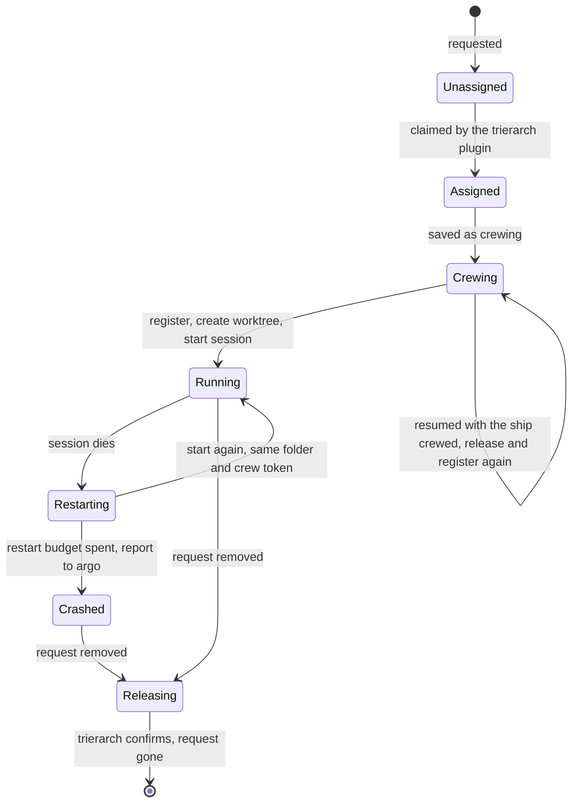

# Trierarch: crewing ships on machines

Model and decisions: 0026 (the trierarch on a machine), 0027 (crew settings), 0029 (the crew request and its scopes) and 0030 (the trierarch plugin). The fleet holds the crew request; everything else here is read only by the trierarch plugin, the trierarchs it manages and the console. `@aeolus-fleet/trierarch-plugin` and `@aeolus-fleet/trierarch` are one implementation, optional, like squadrons; their build is in [architecture.md](architecture.md#the-trierarch). Anyone may write another: this file is what it must do.

Two parts, each its own process and package:

- **The trierarch plugin** (`@aeolus-fleet/trierarch-plugin`), the plugin on the server side, one per installation, beside squadrons: a ship of each fleet it serves. It brings machines into the fleet and picks which machine crews each crew request.
- **A trierarch**, one per machine: a plain process, not an AI, crewing its own ship of type `trierarch`. It crews the ships whose requests are assigned to it, and starts, restarts, wakes and stops their sessions. It never commissions, retires or picks.

Plugins never know each other: a requester (the console, squadrons, an orchestrator ship) only touches ships and their crew requests. Without the trierarch plugin a crew request is the operator's to-do list, crewed by hand.

## The crew request

Declared state on the ship, in the fleet core (decision 0029): "keep this ship crewed, with these settings". At most one per ship, standing (level, not edge). Its parts, each with one writer:

| Part | Holds | Written by | Scope |
| --- | --- | --- | --- |
| Request | The settings (below) | A requester | `fleet:manage` |
| Assignment | The trierarch ship that crews it; set only while unassigned | The trierarch plugin | `crew:assign` |
| Reason | Why no trierarch can take it, while unassigned; shown in the operator's needs-crew to-do | The trierarch plugin | `crew:assign` |
| Status | crewing, running, restarting, crashed, releasing; and who crewed it, the trierarch or argo | The assigned trierarch | `crew:run` |

The server stores the settings without meaning and checks only their size. The settings have a fixed core (decision 0027), whose schema lives in `common`:

- the harness;
- the workspace: a new git worktree of a repository (`{ kind: worktree, repository, ref? }`) or a folder (`{ kind: folder, name }`), each named in the trierarch's local configuration;
- optionally the squadron the ship is a member of, so it checks in at its flagship as a crew line's squadron id does. With a squadron, the session starts with that squadron's crew line and template, as squadrons crews a new member, instead of a plain first prompt;
- an optional first prompt, at most 8 KB, given on the first start only;
- options, checked against the JSON Schema the trierarch reports for that harness.

Settings never carry paths or command-line flags: a workspace names a repository or folder, and options pick named settings.

```json crew request settings
{
  "harness": "claude-code",
  "workspace": { "kind": "worktree", "repository": "aeolus-fleet", "ref": "main" },
  "squadron": "hemma-feature-a1b2c3",
  "firstPrompt": "Review the open pull requests.",
  "options": { "model": "opus" }
}
```

A trierarch's ships are a query, the requests assigned to it, never a list kept on its ship.

The request is the desired state. A ship released elsewhere while its request stands is crewed again by its trierarch. Retiring the ship removes its request (decision 0029).

## Following the fleet

The trierarch plugin follows the fleet's changes: new, changed and removed requests, and reports. Every check-in, of the trierarch plugin and of each trierarch, returns the latest full state (for a trierarch, the requests assigned to it), so a missed event never leaves either stale. The trierarch plugin keeps a small database of its own, the same shape as squadrons': per fleet only the connection (its ship and kept crew token) and the switch, set through installation procedures as squadrons' are (decision 0021). Everything else (requests, statuses, machines) lives in the fleet.

## A machine joins

A trierarch never registers or labels itself.

1. The operator asks the trierarch plugin for a new machine. The trierarch plugin commissions a ship of type `trierarch` with `crew:run` beside the send and receive every agent has, nothing more, and answers its starting prompt.
2. On the machine, `aeolus-trierarch init` takes that starting prompt, registers, writes the configuration and installs the service.
3. The trierarch reports what it can do in its report's details (below).
4. The trierarch plugin labels the machine from that report (labels, #102). Until labels exist, placement reads the report itself.

A trierarch's ship stays a normal ship: it receives messages, such as pings, and sends its crash reports to argo. Releasing it is the kill switch for that machine.

### What a trierarch reports

Its report (state, a one-line note such as "4 of 6 running, 1 crashed") with `details`, read from its local configuration and what runs:

```json trierarch report details
{
  "harnesses": [
    {
      "harness": "claude-code",
      "options": { "type": "object", "properties": { "model": { "enum": ["opus", "sonnet"], "default": "opus" } }, "additionalProperties": false },
      "flags": ["--remote-control"]
    }
  ],
  "workspaces": { "repositories": ["aeolus-fleet"], "folders": ["notes"] },
  "caps": { "ships": 8, "running": 4 },
  "kept": [{ "shipId": "shp_01m473j7hp3x6gha0gzs1mnf88", "path": "/Users/thomas/.aeolus/trierarch/worktrees/aeolus-fleet/scout" }],
  "orphans": [{ "path": "/Users/thomas/.aeolus/trierarch/worktrees/aeolus-fleet/lookout" }],
  "version": "0.18.0"
}
```

Its shape lives in `common`, as the type `trierarch`'s report details. It holds no entry per ship: each request carries its own status.

## Assignment

The trierarch plugin serves unassigned requests oldest first and assigns each to one trierarch:

1. It considers trierarchs that fit: their report offers the request's repository (or folder), harness and model (its options schema for that harness takes the request's options), and they have room (`caps.ships` above the number of requests assigned to it).
2. Of those, it picks the one with the most room as a percentage of its `caps.ships`, then the oldest.
3. It assigns by optimistic claim: the fleet sets the assignment only if the request is still unassigned. A lost claim is no error; the trierarch plugin reads again.
4. It never assigns a request whose ship is crewed already: crewing by hand fulfils a request.
5. When no trierarch can take a request (none offers its harness, workspace or options, or none has room), the trierarch plugin writes the reason on the request. It shows in the operator's needs-crew to-do.

Strategies to change this order come later. The operator does not pick the machine.

A machine is silent when its trierarch's last seen is older than a threshold. The flag shows on the machines page and in needs attention; its requests are not moved.

## Crewing a ship

A trierarch reconciles from the requests assigned to it. Its loop crews each one:

1. It saves the entry as crewing and writes status `crewing`.
2. It gets a starting prompt with `crew:run` and registers with the secret, so the session never sees the secret.
3. It writes the folder's identity through the aeolus plugin, with the squadron when the settings name one, saying the trierarch wakes it.
4. It starts the harness in the folder, with `/aeolus:wake` (Codex: `$aeolus-wake`) as the first prompt, and writes status `running`.

From then on the trierarch watches the ship's inbox while the session runs. It wakes the session when deliveries wait and the session is idle, and restarts a session that dies.

A ship crewed by hand before its trierarch crews it counts as crewed: the trierarch leaves it, and the status shows it was crewed by argo.

### Crashed and Restart

A session that dies is restarted by the trierarch on its own. When its restart budget is spent, the trierarch writes status `crashed` and sends a report to argo: a human decides. The operator's Restart action deletes the request and creates an exact copy behind the scenes; the trierarch sees a new version of its crew record and crews it again.

## Lifecycles

The ship, its crew request, its session and its worktree live and end together:

| # | Event | Ship (fleet) | Crew request | Session | Worktree |
| --- | --- | --- | --- | --- | --- |
| 1 | requested | must exist and await crew | unassigned | none yet | none yet |
| 2 | assigned | awaiting crew | assigned to a trierarch | none yet | none yet |
| 3 | first crew | crewed (the trierarch registers) | crewing, then running | started | created, identity written |
| 4 | session dies | crewed, lease held | restarting | started again in the same folder, same crew token | kept |
| 5 | restart budget spent | crewed, lease held | crashed, a report sent to argo | stopped | kept |
| 6 | the machine restarts | crewed, lease held | unchanged | started again by the loop | kept |
| 7 | request removed | awaiting crew, lease ended | releasing, then gone once the trierarch confirms | stopped | removed if clean; kept and reported if not |
| 8 | the trierarch stops mid-crew (a lost `register` reply among them) | perhaps crewed, by its own lost token | crewing, saved locally before it registered | none, or a stray | perhaps half made |
| 9 | the trierarch is uninstalled | crewed | still assigned to it | stopped first | uninstall lists kept worktrees and deletes nothing |
| 10 | the machine goes silent | as it was | still assigned to it, the machine flagged | unknown | unknown |
| 11 | released elsewhere | awaiting crew, then crewed again by the trierarch | unchanged, crewing, then running | stopped, then started | kept |
| 12 | Restart of a crashed request | as row 7, then as row 1 | removed, then an exact copy requested: a new version | stopped, then started | as row 7, then as row 3 |

The rules that close the gaps:

1. The trierarch removes only what it made: worktrees under its own worktree root, never a configured folder and never a worktree with changes. A kept worktree is reported in its details until a human clears it.
2. Every pass of the loop also looks for strays. A session of the trierarch with no assigned request is stopped. A worktree under its root with no assigned request is reported as an orphan, never deleted.
3. After a stop mid-crew, the loop resumes from its assigned requests and its saved state. An entry still crewing whose ship is crewed was lost between register and its reply: the trierarch releases the ship (`crew:run`) and crews it again. A half-made worktree of an assigned ship is used; one of a ship no longer assigned is an orphan (rule 2).
4. A worktree with changes never holds up releasing the ship: the lease ends either way, so the ship can be crewed elsewhere.
5. The trierarch watches a ship's inbox only while its session runs, so "last seen" still means the session is alive. It reports on the ship's behalf when its session crashes or restarts ("blocked: session crashed, restarting").



## Release

Removing a crew request is the one way to stop a ship's crew through a trierarch. The request is marked releasing; the assigned trierarch stops the session, ends the lease, removes the worktree when clean, and confirms; only then does the request disappear (a finalizer). A restart of the machine is no release. Retire stays separate, for whoever holds `fleet:manage`.

Stopping a session must stop its work, or a release and a restarted crash would leave work running with no one watching it. So a harness adapter starts each session as a process that owns its work. Codex by default runs a session's turns in its shared app-server daemon, which keeps a turn running after the session's pane is gone: the codex adapter always adds `--no-daemon`, as mechanism, the way the Claude Code adapter adds `--continue` on a restart. Neither is the operator's flag.

## The 0.17 protocol, until T4

What the trierarch in `@aeolus-fleet/trierarch` still speaks until the build plan's slice T4 removes it, together with this section: fleet messages to and from the trierarch's ship, with content types `application/vnd.aeolus.trierarch.<name>+json`. The crew request and the report replace it (decision 0027). The running 0.17 setup is not migrated: its sessions are released and the new trierarch crews them again (decision 0013). The schemas in `common` take every example below.

| Command | Answer |
| --- | --- |
| `describe` `{}` | `described` `{ harnesses: [{ harness, options (JSON Schema), flags, adapterFlags: [{ flag, when: always \| restart }] }], workspaces: { repositories, folders }, caps, kept, version }` |
| `want` `{ shipId, harness, workspace: { kind: worktree, repository, ref? } \| { kind: folder, name }, squadron?, firstPrompt?, options }` | `wanted` `{ shipId }` or `refused` `{ shipId, field?, reason }` |
| `release` `{ shipId, force? }` | `released` `{ shipId, workspace: removed \| kept, path? }` |
| `list` `{}` | `listed` `{ ships: [{ shipId, harness, state, since, restarts }], kept, orphans }` |

Notices, unasked, to the ship that sent the want: `running`, `crashed` `{ shipId, exits }` and `leaseEnded` `{ shipId }`. Every answer goes `inReplyTo` its command.

A want's options are checked against the JSON Schema describe gives for its harness; anything unknown is refused, with the field named. Messages never carry paths or command-line flags: a workspace names a repository or folder from the trierarch's configuration, and options pick named settings. A message the trierarch has applied before, by message id, changes nothing.

### Examples

One message of each kind, as its payload travels, labelled with its name and whether it is a command, an answer or a notice. The schemas in `common` take each of these.

```json describe command
{}
```

```json described answer
{
  "harnesses": [
    {
      "harness": "claude-code",
      "options": { "type": "object", "properties": { "model": { "enum": ["opus", "sonnet"], "default": "opus" } }, "additionalProperties": false },
      "flags": ["--remote-control"],
      "adapterFlags": [{ "flag": "--continue", "when": "restart" }]
    }
  ],
  "workspaces": { "repositories": ["aeolus-fleet"], "folders": ["notes"] },
  "caps": { "ships": 8, "running": 4 },
  "kept": [{ "shipId": "shp_01m473j7hp3x6gha0gzs1mnf88", "path": "/Users/thomas/.aeolus/trierarch/worktrees/aeolus-fleet/scout" }],
  "version": "0.1.0"
}
```

```json want command
{
  "shipId": "shp_01m473j7hp3x6gha0gzs1mnf88",
  "harness": "claude-code",
  "workspace": { "kind": "worktree", "repository": "aeolus-fleet", "ref": "main" },
  "squadron": "hemma-feature-a1b2c3",
  "firstPrompt": "Review the open pull requests.",
  "options": { "model": "opus" }
}
```

```json want command
{
  "shipId": "shp_01m473j7hp3x6gha0gzs1mnf88",
  "harness": "claude-code",
  "workspace": { "kind": "folder", "name": "notes" },
  "options": {}
}
```

```json wanted answer
{ "shipId": "shp_01m473j7hp3x6gha0gzs1mnf88" }
```

```json refused answer
{ "shipId": "shp_01m473j7hp3x6gha0gzs1mnf88", "field": "options.model", "reason": "model must be one of opus, sonnet" }
```

```json release command
{ "shipId": "shp_01m473j7hp3x6gha0gzs1mnf88", "force": false }
```

```json released answer
{ "shipId": "shp_01m473j7hp3x6gha0gzs1mnf88", "workspace": "kept", "path": "/Users/thomas/.aeolus/trierarch/worktrees/aeolus-fleet/scout" }
```

```json list command
{}
```

```json listed answer
{
  "ships": [{ "shipId": "shp_01m473j7hp3x6gha0gzs1mnf88", "harness": "claude-code", "state": "running", "since": "2026-10-06T08:00:00.000Z", "restarts": 0 }],
  "kept": [],
  "orphans": [{ "path": "/Users/thomas/.aeolus/trierarch/worktrees/aeolus-fleet/lookout" }]
}
```

```json running notice
{ "shipId": "shp_01m473j7hp3x6gha0gzs1mnf88" }
```

```json crashed notice
{ "shipId": "shp_01m473j7hp3x6gha0gzs1mnf88", "exits": 5 }
```

```json leaseEnded notice
{ "shipId": "shp_01m473j7hp3x6gha0gzs1mnf88" }
```
