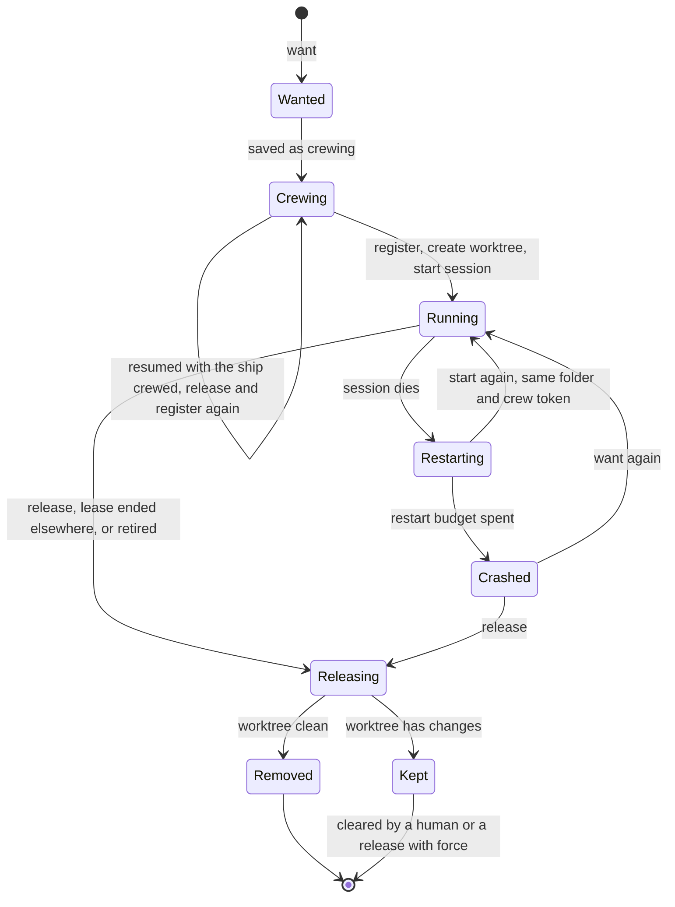

# Trierarch: crewing ships on a machine

Model and decisions: decisions 0002 (`fleet:crew`), 0026 and 0027. Aeolus knows nothing of what is described here. Only a trierarch, and the ships that talk to it, read it. `@aeolus-fleet/trierarch` is one implementation, optional, like squadrons; its build is in [architecture.md](architecture.md#the-trierarch). Anyone may write another dispatcher: this file is what it must do.

A trierarch keeps the ships on its wanted list crewed on its machine. It starts, restarts, wakes and stops their sessions. It crews ships; it never commissions or retires them. It is a plain process, not an AI.

## Crewing a ship

A trierarch is a ship like any other, commissioned with `fleet:crew`, one per machine, and found by listing ships of type `trierarch`. Releasing the trierarch's own ship is the kill switch.

1. Anything with `fleet:manage` commissions a ship: the console as `argo`, squadrons, an orchestrator. There are no naming rules.
2. It sends the trierarch a want with:
   - the ship id and the harness;
   - the workspace: a new git worktree of a repository, or a folder, each named in the trierarch's local configuration. Worktrees go under the trierarch's worktree root, one folder per ship (`<root>/<repository>/<ship>`), so nothing spreads over the home folder. The root is `~/.aeolus/trierarch/worktrees/`, beside the trierarch's other files under `~/.aeolus/trierarch/`, unless the configuration names another;
   - optionally the squadron the ship is a member of, so it checks in at its flagship as a crew line's squadron id does;
   - an optional first prompt, at most 8 KB, given on the first start only;
   - options from what describe offers.
3. The trierarch checks the want against what it describes, saves the entry before it acks, and answers wanted (or refused, naming the field). A message it has applied before changes nothing.
4. Its loop crews the ship:
   - it saves the entry as crewing;
   - it gets a starting prompt with `fleet:crew` and registers with the secret, so the session never sees the secret;
   - it writes the folder's identity through the aeolus plugin, with the squadron when the want names one, saying the trierarch wakes it;
   - it starts the harness in the folder, with `/aeolus:wake` as the first prompt.

   It answers running.
5. From then on the trierarch watches the ship's inbox while the session runs. It wakes the session when deliveries wait and the session is idle, and restarts a session that dies.

Replies go to the sender of a command, and notices (running, crashed, leaseEnded) to the ship that sent the want. Nothing more.

## Lifecycles

The ship, its wanted entry, its session and its worktree live and end together:

| # | Event | Ship (fleet) | Wanted entry | Session | Worktree |
| --- | --- | --- | --- | --- | --- |
| 1 | want | must exist and await crew | added | none yet | none yet |
| 2 | first crew | crewed (the trierarch registers) | running | started | created, identity written |
| 3 | session dies | crewed, lease held | restarting | started again in the same folder, same crew token | kept |
| 4 | restart budget spent | crewed, lease held | crashed, the requester notified | stopped | kept |
| 5 | the machine restarts | crewed, lease held | unchanged | started again by the loop | kept |
| 6 | release (by message) | awaiting crew, lease ended | removed | stopped | removed if clean; kept and reported if not |
| 7 | released or re-crewed elsewhere (the console, another trierarch) | awaiting crew, or crewed by another session | dropped, the requester notified leaseEnded | stopped | as in 6 |
| 8 | retired while wanted | retired | dropped, the requester notified leaseEnded | stopped | as in 6 |
| 9 | the trierarch stops mid-crew (a lost `register` reply among them) | perhaps crewed, by its own lost token | still on the list, saved as crewing before it registered | none, or a stray | perhaps half made |
| 10 | the trierarch is uninstalled | crewed | gone with the trierarch | stopped first | uninstall lists kept worktrees and deletes nothing |

The rules that close the gaps:

1. The trierarch removes only what it made: worktrees under its own worktree root, never a configured folder and never a worktree with changes. A kept worktree is reported by describe and list until a human, or a release with force, clears it.
2. Every pass of the loop also looks for strays. A session of the trierarch with no entry is stopped. A worktree under its root with no entry is reported as an orphan, never deleted.
3. After a stop mid-crew, the loop resumes from the saved list. An entry still crewing whose ship is crewed was lost between register and its reply: the trierarch releases the ship (`fleet:crew`) and crews it again. A want for a ship crewed by any other session is refused. A half-made worktree of a wanted ship is used; one of a ship no longer wanted is an orphan (rule 2).
4. A worktree with changes never holds up releasing the ship: the lease ends either way, so the ship can be crewed elsewhere.
5. The trierarch watches a ship's inbox only while its session runs, so "last seen" still means the session is alive. It reports on the ship's behalf when its session crashes or restarts ("blocked: session crashed, restarting").



## Release

Release is the one command that stops a ship: it stops the session, ends the lease, removes the entry, and removes the worktree when it is clean. A restart of the machine is no release. Retire stays separate, for whoever holds `fleet:manage`.

Stopping a session must stop its work, or a release and a restarted crash would leave work running with no one watching it. So a harness adapter starts each session as a process that owns its work. Codex by default runs a session's turns in its shared app-server daemon, which keeps a turn running after the session's pane is gone: the codex adapter always adds `--no-daemon`, as mechanism, the way the Claude Code adapter adds `--continue` on a restart. Neither is the operator's flag.

## The protocol

Fleet messages to and from the trierarch's ship, with content types `application/vnd.aeolus.trierarch.<name>+json`, by convention: Aeolus reads none of them. The schemas live in `common`, beside the configuration's schema, so the trierarch, the console and squadrons share them. Anyone may implement a dispatcher that speaks it: the core below is fixed, and each dispatcher advertises its options (decision 0027).

| Command | Answer |
| --- | --- |
| `describe` `{}` | `described` `{ harnesses: [{ harness, options (JSON Schema), flags, adapterFlags: [{ flag, when: always \| restart }] }], workspaces: { repositories, folders }, caps, kept, version }` |
| `want` `{ shipId, harness, workspace: { kind: worktree, repository, ref? } \| { kind: folder, name }, squadron?, firstPrompt?, options }` | `wanted` `{ shipId }` or `refused` `{ shipId, field?, reason }` |
| `release` `{ shipId, force? }` | `released` `{ shipId, workspace: removed \| kept, path? }` |
| `list` `{}` | `listed` `{ ships: [{ shipId, harness, state, since, restarts }], kept, orphans }` |

Notices, unasked, to the ship that sent the want: `running`, `crashed` `{ shipId, exits }` and `leaseEnded` `{ shipId }`. Every answer goes `inReplyTo` its command.

A want's options are checked against the JSON Schema describe gives for its harness; anything unknown is refused, with the field named. Messages never carry paths or command-line flags: a workspace names a repository or folder from the trierarch's configuration, and options pick named settings. A message the trierarch has applied before, by message id, changes nothing.

### Examples

One message of each kind, as its payload travels, labelled with its name and whether it is a command, an answer or a notice. The schemas in `common` take each of these.

```json describe command
{}
```

```json described answer
{
  "harnesses": [
    {
      "harness": "claude-code",
      "options": { "type": "object", "properties": { "model": { "enum": ["opus", "sonnet"], "default": "opus" } }, "additionalProperties": false },
      "flags": ["--remote-control"],
      "adapterFlags": [{ "flag": "--continue", "when": "restart" }]
    }
  ],
  "workspaces": { "repositories": ["aeolus-fleet"], "folders": ["notes"] },
  "caps": { "ships": 8, "running": 4 },
  "kept": [{ "shipId": "shp_01m473j7hp3x6gha0gzs1mnf88", "path": "/Users/thomas/.aeolus/trierarch/worktrees/aeolus-fleet/scout" }],
  "version": "0.1.0"
}
```

```json want command
{
  "shipId": "shp_01m473j7hp3x6gha0gzs1mnf88",
  "harness": "claude-code",
  "workspace": { "kind": "worktree", "repository": "aeolus-fleet", "ref": "main" },
  "squadron": "hemma-feature-a1b2c3",
  "firstPrompt": "Review the open pull requests.",
  "options": { "model": "opus" }
}
```

```json want command
{
  "shipId": "shp_01m473j7hp3x6gha0gzs1mnf88",
  "harness": "claude-code",
  "workspace": { "kind": "folder", "name": "notes" },
  "options": {}
}
```

```json wanted answer
{ "shipId": "shp_01m473j7hp3x6gha0gzs1mnf88" }
```

```json refused answer
{ "shipId": "shp_01m473j7hp3x6gha0gzs1mnf88", "field": "options.model", "reason": "model must be one of opus, sonnet" }
```

```json release command
{ "shipId": "shp_01m473j7hp3x6gha0gzs1mnf88", "force": false }
```

```json released answer
{ "shipId": "shp_01m473j7hp3x6gha0gzs1mnf88", "workspace": "kept", "path": "/Users/thomas/.aeolus/trierarch/worktrees/aeolus-fleet/scout" }
```

```json list command
{}
```

```json listed answer
{
  "ships": [{ "shipId": "shp_01m473j7hp3x6gha0gzs1mnf88", "harness": "claude-code", "state": "running", "since": "2026-10-06T08:00:00.000Z", "restarts": 0 }],
  "kept": [],
  "orphans": [{ "path": "/Users/thomas/.aeolus/trierarch/worktrees/aeolus-fleet/lookout" }]
}
```

```json running notice
{ "shipId": "shp_01m473j7hp3x6gha0gzs1mnf88" }
```

```json crashed notice
{ "shipId": "shp_01m473j7hp3x6gha0gzs1mnf88", "exits": 5 }
```

```json leaseEnded notice
{ "shipId": "shp_01m473j7hp3x6gha0gzs1mnf88" }
```
